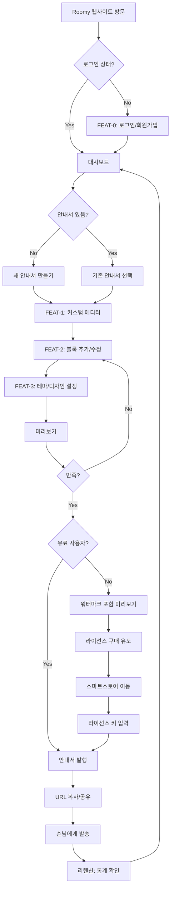
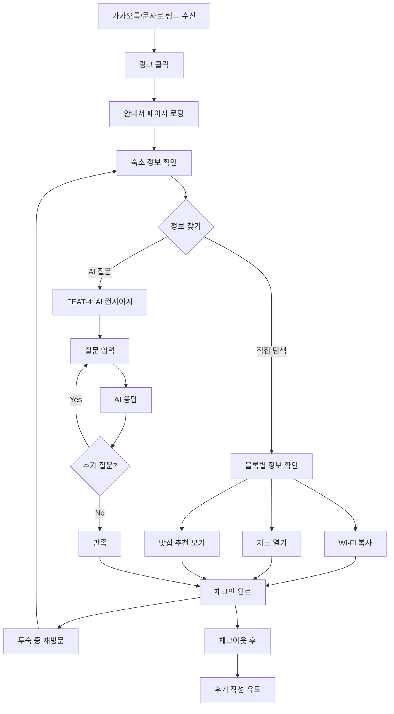
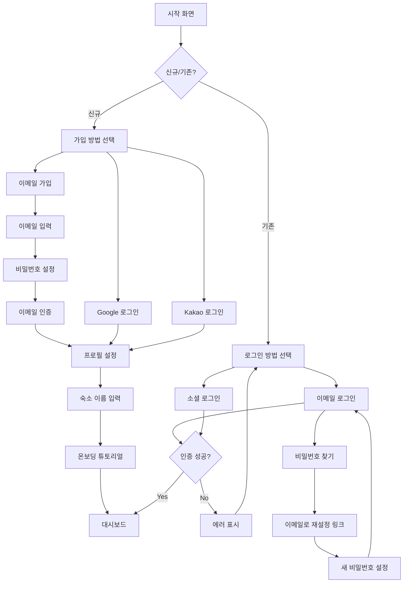
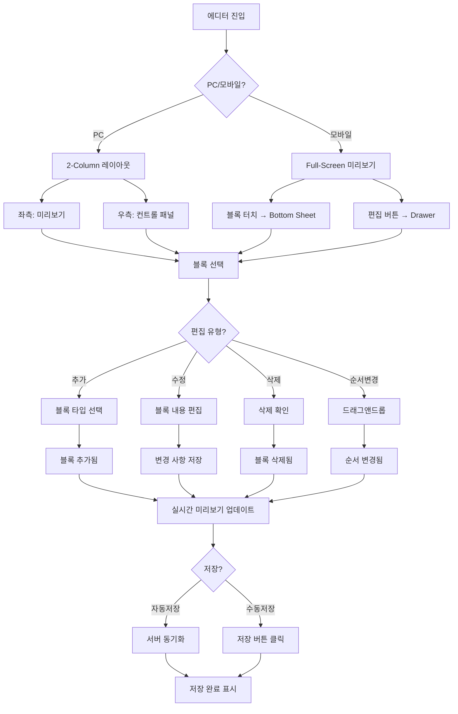
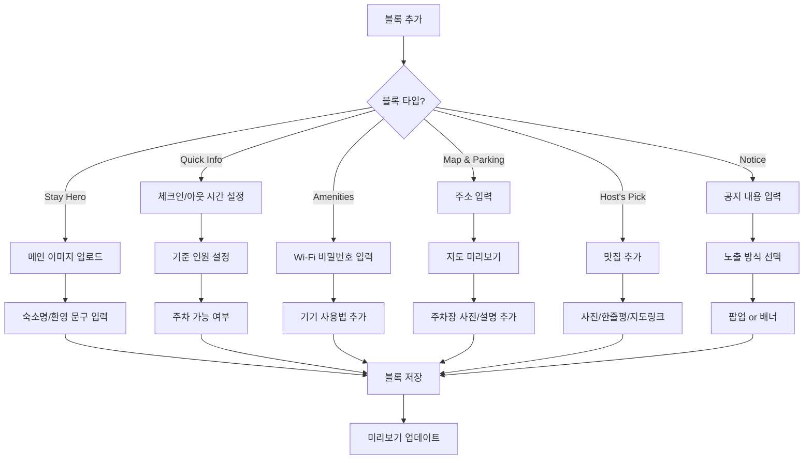
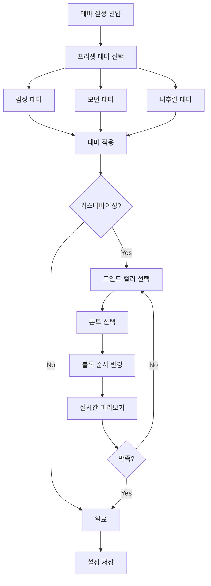
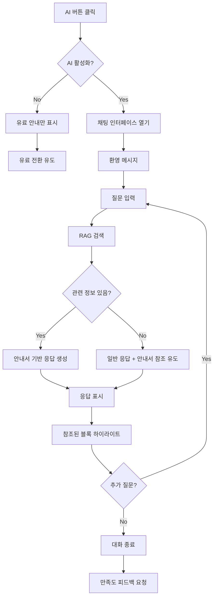
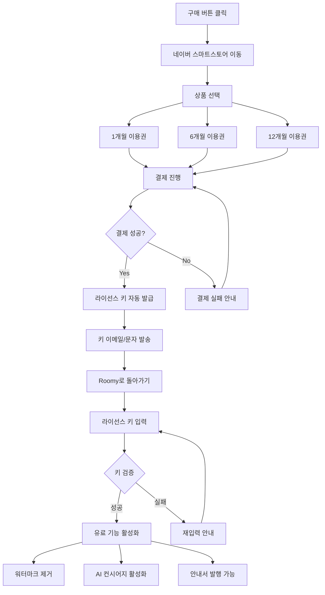
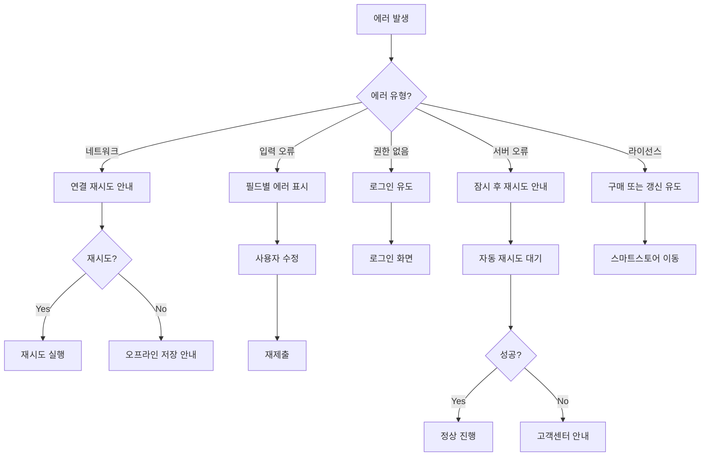

# User Flow (사용자 흐름도) - Roomy

> Mermaid 플로우차트로 핵심 기능의 주요 여정을 표현합니다.
> 성공/실패 분기를 포함하고, 온보딩→핵심작업→리텐션 루프를 표현합니다.

---

## MVP 캡슐

| # | 항목 | 내용 |
|---|------|------|
| 1 | 목표 | 호스트의 시간을 벌어주고 숙소의 브랜드 가치를 높여주는 운영 솔루션 |
| 2 | 페르소나 | 감성 숙소/펜션/에어비앤비 호스트 (디자인과 고객 경험 중시, 반복 문의에 지친 상태) |
| 3 | 핵심 기능 | FEAT-1: 커스텀 에디터 (블록형 안내서 제작/수정) |
| 4 | 성공 지표 (노스스타) | 무료 → 유료 라이선스 전환율 |
| 5 | 입력 지표 | 신규 가입 호스트 수, 안내서 조회 수 |
| 6 | 비기능 요구 | 모바일에서도 PC와 동일한 수준의 에디터 경험 제공 |
| 7 | Out-of-scope | 예약 관리, 결제 시스템 자체 구현, 다크 모드 |
| 8 | Top 리스크 | 모바일 에디터 UX가 복잡해져 진입장벽이 높아질 위험 |
| 9 | 완화/실험 | 5명 이상의 실제 호스트와 프로토타입 테스트 |
| 10 | 다음 단계 | 커스텀 에디터 코어 개발 시작 |

---

## 1. 전체 사용자 여정 (Overview)

### 1.1 호스트 여정

### 1.2 게스트 여정

---

## 2. FEAT-0: 온보딩/로그인 플로우

---

## 3. FEAT-1: 커스텀 에디터 플로우

---

## 4. FEAT-2: 필수 정보 블록 플로우

---

## 5. FEAT-3: 테마/디자인 플로우

---

## 6. FEAT-4: AI 컨시어지 플로우

---

## 7. 라이선스 구매 플로우

---

## 8. 에러 처리 플로우

---

## 9. 화면 목록 (Screen Inventory)

| 화면 ID | 화면명 | FEAT | 진입점 | 주요 액션 |
|---------|--------|------|--------|----------|
| S-01 | 랜딩 페이지 | - | URL 직접 접속 | 서비스 소개, 시작하기 |
| S-02 | 로그인 | FEAT-0 | S-01 | 이메일/소셜 로그인 |
| S-03 | 회원가입 | FEAT-0 | S-02 | 계정 생성 |
| S-04 | 대시보드 | - | 로그인 후 | 안내서 목록, 새로 만들기 |
| S-05 | 에디터 (PC) | FEAT-1 | S-04 | 블록 편집, 테마 설정 |
| S-06 | 에디터 (모바일) | FEAT-1 | S-04 | Bottom Sheet 편집 |
| S-07 | 블록 추가 모달 | FEAT-2 | S-05/S-06 | 블록 타입 선택 |
| S-08 | 테마 설정 패널 | FEAT-3 | S-05/S-06 | 프리셋/커스텀 설정 |
| S-09 | 미리보기 | FEAT-1 | S-05/S-06 | 최종 확인 |
| S-10 | 게스트 안내서 | - | /g/{slug} | 정보 확인, AI 질문 |
| S-11 | AI 채팅 | FEAT-4 | S-10 | 질문/답변 |
| S-12 | 라이선스 관리 | - | S-04 | 키 입력, 갱신 |
| S-13 | 설정 | - | S-04 | 프로필, 계정 관리 |

---

## Decision Log 참조

| ID | 항목 | 선택 | 근거 |
|----|------|------|------|
| UX-01 | 모바일 에디터 | Bottom Sheet + Drawer | PC 기능 100% 지원하면서 모바일 최적화 |
| UX-02 | 게스트 로그인 | 불필요 | 1박 투숙객에게 회원가입은 과한 요구 |
| UX-03 | 자동 저장 | 활성화 | 작업 유실 방지, 사용자 편의 |
| UX-04 | AI 진입점 | Floating Button | 언제든 접근 가능, 방해되지 않음 |
