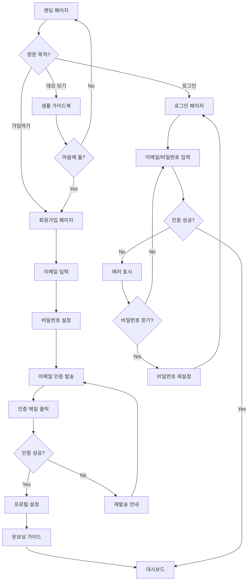

# User Flow (사용자 흐름도) - Roomy (루미)

> Mermaid 플로우차트로 핵심 기능의 주요 여정을 표현합니다.
> 호스트(관리자)와 손님(게스트) 두 가지 사용자 유형을 구분합니다.

---

## MVP 캡슐

| # | 항목 | 내용 |
|---|------|------|
| 1 | 목표 | 호스트의 반복 문의 응대 부담을 줄이고, 손님에게 필요한 정보를 링크 하나로 제공 |
| 2 | 페르소나 | 30대 에어비앤비/펜션 호스트 (직접 운영, 감성 숙소) |
| 3 | 핵심 기능 | FEAT-1: 필수 정보 블록 (와이파이 복사, 지도 연동 등) |
| 4 | 성공 지표 (노스스타) | 유료 구매 고객 수 |
| 5 | 입력 지표 | 주간 신규 가입 호스트 수, 가이드북 조회 수 |
| 6 | 비기능 요구 | 모바일 첫 화면 로딩 2초 이내 (SSR 최적화) |
| 7 | Out-of-scope | AI 챗봇 (v2), 결제 연동 (v2), 소셜 로그인 (v2) |
| 8 | Top 리스크 | 기존 노션/종이 안내문에 익숙한 호스트가 전환하지 않을 수 있음 |
| 9 | 완화/실험 | 무료 체험 후 유료 전환 유도, "10분 만에 만드는 가이드북" 온보딩 |
| 10 | 다음 단계 | 랜딩 페이지 제작 및 베타 테스터 모집 |

---

## 1. 전체 사용자 여정 (Overview)


---

## 2. FEAT-0: 호스트 온보딩/인증 플로우



---

## 3. FEAT-1: 필수 정보 블록 입력 플로우 (호스트)

```mermaid
graph TD
    A[가이드북 편집] --> B[정보 블록 선택]

    B --> C{블록 유형?}

    %% 와이파이 블록
    C -->|와이파이| D[와이파이 블록 추가]
    D --> E[SSID 입력]
    E --> F[비밀번호 입력]
    F --> G[저장]

    %% 지도 블록
    C -->|지도| H[지도 블록 추가]
    H --> I[주소 검색]
    I --> J[Kakao Maps 검색]
    J --> K{결과 있음?}
    K -->|Yes| L[위치 선택]
    K -->|No| M[직접 좌표 입력]
    L --> G
    M --> G

    %% 체크인/아웃 블록
    C -->|체크인/아웃| N[시간 블록 추가]
    N --> O[체크인 시간 선택]
    O --> P[체크아웃 시간 선택]
    P --> G

    %% 맛집 추천 블록
    C -->|맛집 추천| Q[추천 블록 추가]
    Q --> R[장소 이름 입력]
    R --> S[설명 입력]
    S --> T[위치 추가 (선택)]
    T --> G

    %% 저장 후 처리
    G --> U{다른 블록 추가?}
    U -->|Yes| B
    U -->|No| V[미리보기]
    V --> W{수정 필요?}
    W -->|Yes| B
    W -->|No| X[발행]
```

---

## 4. FEAT-2: 모바일 가이드북 조회 플로우 (손님)


---

## 5. FEAT-3: 가이드북 관리 플로우 (호스트)


---

## 6. 에러 처리 플로우


---

## 7. 화면 목록 (Screen Inventory)

### 7.1 공개 페이지 (손님/비회원)

| 화면 ID | 화면명 | FEAT | 경로 | 주요 액션 |
|---------|--------|------|------|----------|
| S-01 | 랜딩 페이지 | - | `/` | 서비스 소개, 가입 유도 |
| S-02 | 가이드북 뷰 | FEAT-1,2 | `/[slug]` | 정보 확인, 복사, 지도 열기 |
| S-03 | 404 페이지 | - | `/404` | 랜딩 유도 |

### 7.2 인증 페이지 (호스트)

| 화면 ID | 화면명 | FEAT | 경로 | 주요 액션 |
|---------|--------|------|------|----------|
| S-10 | 로그인 | FEAT-0 | `/login` | 이메일 로그인 |
| S-11 | 회원가입 | FEAT-0 | `/signup` | 계정 생성 |
| S-12 | 이메일 인증 | FEAT-0 | `/verify` | 인증 확인 |
| S-13 | 비밀번호 재설정 | FEAT-0 | `/reset-password` | 비밀번호 변경 |

### 7.3 대시보드 페이지 (호스트, 로그인 필수)

| 화면 ID | 화면명 | FEAT | 경로 | 주요 액션 |
|---------|--------|------|------|----------|
| S-20 | 대시보드 | FEAT-3 | `/dashboard` | 가이드북 목록, 통계 |
| S-21 | 가이드북 생성 | FEAT-3 | `/dashboard/new` | 새 가이드북 |
| S-22 | 가이드북 편집 | FEAT-1,3 | `/dashboard/[id]/edit` | 정보 블록 편집 |
| S-23 | 설정 | - | `/dashboard/settings` | 프로필, 계정 관리 |

---

## 8. 핵심 사용자 시나리오

### 8.1 호스트 민지의 첫 가이드북 생성

```
1. 랜딩 페이지 방문 (S-01)
2. "시작하기" 클릭 → 회원가입 (S-11)
3. 이메일 입력, 비밀번호 설정
4. 이메일 인증 완료 (S-12)
5. 대시보드 진입 (S-20)
6. "새 가이드북 만들기" 클릭 (S-21)
7. 숙소 이름 "민지네 감성 숙소", 슬러그 "minjis-house" 입력
8. 대표 이미지 업로드
9. 가이드북 편집 진입 (S-22)
10. 와이파이 블록 추가: SSID, 비밀번호 입력
11. 지도 블록 추가: 주차장 위치 검색
12. 체크인/아웃 블록 추가: 15:00 / 11:00
13. 맛집 추천 블록 추가: 2~3개 장소
14. 미리보기 확인
15. "발행" 클릭
16. 링크 복사: roomy.kr/minjis-house
17. 카톡으로 손님에게 전송
```

### 8.2 손님 준호의 가이드북 이용

```
1. 카톡에서 링크 클릭
2. 가이드북 페이지 로딩 (S-02)
3. 와이파이 블록에서 "복사" 버튼 클릭
4. 설정 > Wi-Fi에서 비밀번호 붙여넣기
5. 지도 블록에서 주차장 위치 확인
6. "카카오맵에서 열기" 클릭 → 내비게이션 시작
7. 맛집 추천 블록에서 저녁 메뉴 탐색
8. 마음에 드는 맛집 위치 확인
```

---

## Decision Log 참조

| ID | 항목 | 선택 | 근거 |
|----|------|------|------|
| D-11 | 손님 로그인 | 불필요 | 1박 숙박에 회원가입은 부담, 링크로 바로 접근 |
| D-12 | 온보딩 | 10분 완성 가이드 | 빠른 가치 전달로 전환율 향상 |
| D-13 | 지도 앱 연결 | 선택 가능 | 사용자 선호에 따라 카카오/네이버/애플 지도 |
| D-14 | 슬러그 | 호스트 직접 설정 | SEO + 브랜딩, 기억하기 쉬운 URL |
