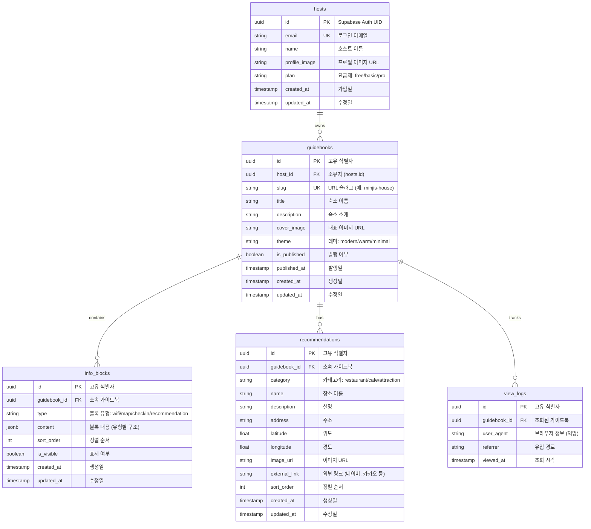
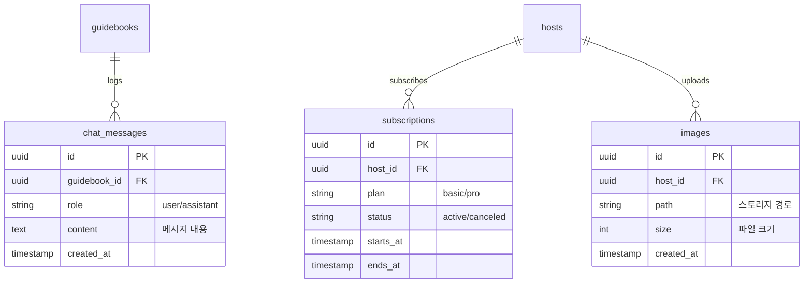

# Database Design (데이터베이스 설계) - Roomy (루미)

> Mermaid ERD로 주요 엔티티와 관계를 표현합니다.
> 각 엔티티에 FEAT 주석을 달아 어떤 기능에서 사용되는지 명시합니다.
> 최소 수집 원칙을 반영하여 불필요한 개인정보는 지양합니다.

---

## MVP 캡슐

| # | 항목 | 내용 |
|---|------|------|
| 1 | 목표 | 호스트의 반복 문의 응대 부담을 줄이고, 손님에게 필요한 정보를 링크 하나로 제공 |
| 2 | 페르소나 | 30대 에어비앤비/펜션 호스트 (직접 운영, 감성 숙소) |
| 3 | 핵심 기능 | FEAT-1: 필수 정보 블록 (와이파이 복사, 지도 연동 등) |
| 4 | 성공 지표 (노스스타) | 유료 구매 고객 수 |
| 5 | 입력 지표 | 주간 신규 가입 호스트 수, 가이드북 조회 수 |
| 6 | 비기능 요구 | 모바일 첫 화면 로딩 2초 이내 (SSR 최적화) |
| 7 | Out-of-scope | AI 챗봇 (v2), 결제 연동 (v2), 소셜 로그인 (v2) |
| 8 | Top 리스크 | 기존 노션/종이 안내문에 익숙한 호스트가 전환하지 않을 수 있음 |
| 9 | 완화/실험 | 무료 체험 후 유료 전환 유도, "10분 만에 만드는 가이드북" 온보딩 |
| 10 | 다음 단계 | 랜딩 페이지 제작 및 베타 테스터 모집 |

---

## 1. ERD (Entity Relationship Diagram)



---

## 2. 엔티티 상세 정의

### 2.1 hosts (호스트) - FEAT-0

> Supabase Auth와 연동됩니다. `id`는 Supabase Auth의 UID를 사용합니다.

| 컬럼 | 타입 | 제약조건 | 설명 |
|------|------|----------|------|
| id | UUID | PK | Supabase Auth UID |
| email | VARCHAR(255) | UNIQUE, NOT NULL | 로그인 이메일 |
| name | VARCHAR(100) | NOT NULL | 호스트 이름 (표시용) |
| profile_image | VARCHAR(500) | NULL | 프로필 이미지 URL |
| plan | VARCHAR(20) | NOT NULL, DEFAULT 'free' | 요금제: free/basic/pro |
| created_at | TIMESTAMP | NOT NULL, DEFAULT NOW() | 가입일 |
| updated_at | TIMESTAMP | NOT NULL, DEFAULT NOW() | 수정일 |

**인덱스:**
- `idx_hosts_email` ON email

**최소 수집 원칙 적용:**
- 필수: email, name
- 선택: profile_image
- 수집 안 함: 전화번호, 사업자번호 (v2 결제 시 추가 검토)

**RLS 정책:**
```sql
-- 호스트는 본인 데이터만 접근 가능
CREATE POLICY "Hosts can view own data"
ON hosts FOR SELECT
USING (auth.uid() = id);

CREATE POLICY "Hosts can update own data"
ON hosts FOR UPDATE
USING (auth.uid() = id);
```

---

### 2.2 guidebooks (가이드북) - FEAT-2, FEAT-3

| 컬럼 | 타입 | 제약조건 | 설명 |
|------|------|----------|------|
| id | UUID | PK, DEFAULT gen_random_uuid() | 고유 식별자 |
| host_id | UUID | FK → hosts.id, NOT NULL | 소유자 |
| slug | VARCHAR(100) | UNIQUE, NOT NULL | URL 슬러그 (예: minjis-house) |
| title | VARCHAR(200) | NOT NULL | 숙소 이름 |
| description | TEXT | NULL | 숙소 소개 |
| cover_image | VARCHAR(500) | NULL | 대표 이미지 URL |
| theme | VARCHAR(20) | NOT NULL, DEFAULT 'modern' | 테마 |
| is_published | BOOLEAN | NOT NULL, DEFAULT FALSE | 발행 여부 |
| published_at | TIMESTAMP | NULL | 발행일 |
| created_at | TIMESTAMP | NOT NULL, DEFAULT NOW() | 생성일 |
| updated_at | TIMESTAMP | NOT NULL, DEFAULT NOW() | 수정일 |

**인덱스:**
- `idx_guidebooks_host_id` ON host_id
- `idx_guidebooks_slug` ON slug (UNIQUE)
- `idx_guidebooks_is_published` ON is_published WHERE is_published = TRUE

**RLS 정책:**
```sql
-- 발행된 가이드북은 누구나 조회 가능
CREATE POLICY "Published guidebooks are public"
ON guidebooks FOR SELECT
USING (is_published = TRUE);

-- 호스트는 본인 가이드북만 CRUD 가능
CREATE POLICY "Hosts can CRUD own guidebooks"
ON guidebooks FOR ALL
USING (auth.uid() = host_id);
```

---

### 2.3 info_blocks (정보 블록) - FEAT-1

> JSONB를 사용하여 유형별 유연한 데이터 구조를 지원합니다.

| 컬럼 | 타입 | 제약조건 | 설명 |
|------|------|----------|------|
| id | UUID | PK, DEFAULT gen_random_uuid() | 고유 식별자 |
| guidebook_id | UUID | FK → guidebooks.id, NOT NULL | 소속 가이드북 |
| type | VARCHAR(50) | NOT NULL | 블록 유형 |
| content | JSONB | NOT NULL | 블록 내용 |
| sort_order | INTEGER | NOT NULL, DEFAULT 0 | 정렬 순서 |
| is_visible | BOOLEAN | NOT NULL, DEFAULT TRUE | 표시 여부 |
| created_at | TIMESTAMP | NOT NULL, DEFAULT NOW() | 생성일 |
| updated_at | TIMESTAMP | NOT NULL, DEFAULT NOW() | 수정일 |

**블록 유형별 content 구조:**

```typescript
// type: 'wifi'
{
  ssid: string;          // 와이파이 이름
  password: string;      // 비밀번호
  note?: string;         // 추가 안내 (예: "5G 권장")
}

// type: 'map'
{
  label: string;         // 표시 라벨 (예: "숙소 위치", "주차장")
  address: string;       // 주소
  latitude: number;      // 위도
  longitude: number;     // 경도
  note?: string;         // 추가 안내
}

// type: 'checkin'
{
  checkin_time: string;  // 체크인 시간 (예: "15:00")
  checkout_time: string; // 체크아웃 시간 (예: "11:00")
  note?: string;         // 추가 안내 (예: "늦은 체크인 사전 연락")
}

// type: 'custom'
{
  title: string;         // 제목
  body: string;          // 본문 (마크다운 지원)
}
```

**인덱스:**
- `idx_info_blocks_guidebook_id` ON guidebook_id
- `idx_info_blocks_sort_order` ON (guidebook_id, sort_order)

**RLS 정책:**
```sql
-- 발행된 가이드북의 블록은 공개
CREATE POLICY "Blocks of published guidebooks are public"
ON info_blocks FOR SELECT
USING (
  EXISTS (
    SELECT 1 FROM guidebooks
    WHERE guidebooks.id = info_blocks.guidebook_id
    AND guidebooks.is_published = TRUE
  )
);

-- 호스트는 본인 가이드북의 블록만 CRUD 가능
CREATE POLICY "Hosts can CRUD own blocks"
ON info_blocks FOR ALL
USING (
  EXISTS (
    SELECT 1 FROM guidebooks
    WHERE guidebooks.id = info_blocks.guidebook_id
    AND guidebooks.host_id = auth.uid()
  )
);
```

---

### 2.4 recommendations (추천 장소) - FEAT-1

| 컬럼 | 타입 | 제약조건 | 설명 |
|------|------|----------|------|
| id | UUID | PK, DEFAULT gen_random_uuid() | 고유 식별자 |
| guidebook_id | UUID | FK → guidebooks.id, NOT NULL | 소속 가이드북 |
| category | VARCHAR(50) | NOT NULL | 카테고리 |
| name | VARCHAR(200) | NOT NULL | 장소 이름 |
| description | TEXT | NULL | 설명 |
| address | VARCHAR(500) | NULL | 주소 |
| latitude | DECIMAL(10, 7) | NULL | 위도 |
| longitude | DECIMAL(10, 7) | NULL | 경도 |
| image_url | VARCHAR(500) | NULL | 이미지 URL |
| external_link | VARCHAR(500) | NULL | 외부 링크 |
| sort_order | INTEGER | NOT NULL, DEFAULT 0 | 정렬 순서 |
| created_at | TIMESTAMP | NOT NULL, DEFAULT NOW() | 생성일 |
| updated_at | TIMESTAMP | NOT NULL, DEFAULT NOW() | 수정일 |

**카테고리:**
- `restaurant`: 맛집
- `cafe`: 카페
- `attraction`: 관광지/명소
- `convenience`: 편의시설 (마트, 약국 등)

**인덱스:**
- `idx_recommendations_guidebook_id` ON guidebook_id
- `idx_recommendations_category` ON (guidebook_id, category)

---

### 2.5 view_logs (조회 로그) - 분석용

> 익명화된 조회 통계용 데이터입니다. 개인정보는 저장하지 않습니다.

| 컬럼 | 타입 | 제약조건 | 설명 |
|------|------|----------|------|
| id | UUID | PK, DEFAULT gen_random_uuid() | 고유 식별자 |
| guidebook_id | UUID | FK → guidebooks.id, NOT NULL | 조회된 가이드북 |
| user_agent | VARCHAR(500) | NULL | 브라우저 정보 (익명) |
| referrer | VARCHAR(500) | NULL | 유입 경로 |
| viewed_at | TIMESTAMP | NOT NULL, DEFAULT NOW() | 조회 시각 |

**인덱스:**
- `idx_view_logs_guidebook_id` ON guidebook_id
- `idx_view_logs_viewed_at` ON viewed_at DESC

**최소 수집 원칙:**
- IP 주소: 저장 안 함
- 쿠키/세션: 저장 안 함
- 보존 기간: 30일 후 삭제

---

## 3. 관계 정의

| 부모 | 자식 | 관계 | ON DELETE | 설명 |
|------|------|------|-----------|------|
| hosts | guidebooks | 1:N | CASCADE | 호스트 탈퇴 시 가이드북 삭제 |
| guidebooks | info_blocks | 1:N | CASCADE | 가이드북 삭제 시 블록 삭제 |
| guidebooks | recommendations | 1:N | CASCADE | 가이드북 삭제 시 추천 삭제 |
| guidebooks | view_logs | 1:N | CASCADE | 가이드북 삭제 시 로그 삭제 |

---

## 4. 데이터 생명주기

| 엔티티 | 생성 시점 | 보존 기간 | 삭제 방식 |
|--------|----------|----------|----------|
| hosts | 회원가입 | 탈퇴 후 30일 | Hard delete + Cascade |
| guidebooks | 가이드북 생성 | 계정과 동일 | Cascade delete |
| info_blocks | 블록 추가 | 가이드북과 동일 | Cascade delete |
| recommendations | 추천 추가 | 가이드북과 동일 | Cascade delete |
| view_logs | 페이지 조회 | 30일 | Hard delete (cron job) |

---

## 5. Drizzle 스키마 예시

```typescript
// src/db/schema.ts
import { pgTable, uuid, varchar, text, boolean, timestamp, integer, jsonb, decimal } from 'drizzle-orm/pg-core';

export const hosts = pgTable('hosts', {
  id: uuid('id').primaryKey(),
  email: varchar('email', { length: 255 }).notNull().unique(),
  name: varchar('name', { length: 100 }).notNull(),
  profileImage: varchar('profile_image', { length: 500 }),
  plan: varchar('plan', { length: 20 }).notNull().default('free'),
  createdAt: timestamp('created_at').notNull().defaultNow(),
  updatedAt: timestamp('updated_at').notNull().defaultNow(),
});

export const guidebooks = pgTable('guidebooks', {
  id: uuid('id').primaryKey().defaultRandom(),
  hostId: uuid('host_id').notNull().references(() => hosts.id, { onDelete: 'cascade' }),
  slug: varchar('slug', { length: 100 }).notNull().unique(),
  title: varchar('title', { length: 200 }).notNull(),
  description: text('description'),
  coverImage: varchar('cover_image', { length: 500 }),
  theme: varchar('theme', { length: 20 }).notNull().default('modern'),
  isPublished: boolean('is_published').notNull().default(false),
  publishedAt: timestamp('published_at'),
  createdAt: timestamp('created_at').notNull().defaultNow(),
  updatedAt: timestamp('updated_at').notNull().defaultNow(),
});

export const infoBlocks = pgTable('info_blocks', {
  id: uuid('id').primaryKey().defaultRandom(),
  guidebookId: uuid('guidebook_id').notNull().references(() => guidebooks.id, { onDelete: 'cascade' }),
  type: varchar('type', { length: 50 }).notNull(),
  content: jsonb('content').notNull(),
  sortOrder: integer('sort_order').notNull().default(0),
  isVisible: boolean('is_visible').notNull().default(true),
  createdAt: timestamp('created_at').notNull().defaultNow(),
  updatedAt: timestamp('updated_at').notNull().defaultNow(),
});

export const recommendations = pgTable('recommendations', {
  id: uuid('id').primaryKey().defaultRandom(),
  guidebookId: uuid('guidebook_id').notNull().references(() => guidebooks.id, { onDelete: 'cascade' }),
  category: varchar('category', { length: 50 }).notNull(),
  name: varchar('name', { length: 200 }).notNull(),
  description: text('description'),
  address: varchar('address', { length: 500 }),
  latitude: decimal('latitude', { precision: 10, scale: 7 }),
  longitude: decimal('longitude', { precision: 10, scale: 7 }),
  imageUrl: varchar('image_url', { length: 500 }),
  externalLink: varchar('external_link', { length: 500 }),
  sortOrder: integer('sort_order').notNull().default(0),
  createdAt: timestamp('created_at').notNull().defaultNow(),
  updatedAt: timestamp('updated_at').notNull().defaultNow(),
});

export const viewLogs = pgTable('view_logs', {
  id: uuid('id').primaryKey().defaultRandom(),
  guidebookId: uuid('guidebook_id').notNull().references(() => guidebooks.id, { onDelete: 'cascade' }),
  userAgent: varchar('user_agent', { length: 500 }),
  referrer: varchar('referrer', { length: 500 }),
  viewedAt: timestamp('viewed_at').notNull().defaultNow(),
});
```

---

## 6. 확장 고려사항 (v2)

### 6.1 v2에서 추가 예정 엔티티



### 6.2 인덱스 전략

| 테이블 | 인덱스 | 용도 |
|--------|--------|------|
| guidebooks | slug (UNIQUE) | 공개 URL 조회 최적화 |
| guidebooks | (host_id, is_published) | 호스트별 발행 목록 |
| info_blocks | (guidebook_id, sort_order) | 블록 순서 조회 |
| view_logs | (guidebook_id, viewed_at) | 통계 집계 |

### 6.3 pgvector 확장 (v2 AI 챗봇)

```sql
-- v2: AI 챗봇 RAG용 벡터 저장
CREATE EXTENSION IF NOT EXISTS vector;

ALTER TABLE guidebooks
ADD COLUMN embedding vector(1536);

CREATE INDEX idx_guidebooks_embedding
ON guidebooks USING ivfflat (embedding vector_cosine_ops);
```

---

## Decision Log 참조

| ID | 항목 | 선택 | 근거 |
|----|------|------|------|
| D-15 | DB | Supabase PostgreSQL | 무료 티어, RLS 지원, pgvector 확장 |
| D-16 | ORM | Drizzle | 타입 안전, 경량, SQL-like |
| D-17 | 블록 구조 | JSONB | 유형별 유연한 데이터 구조 |
| D-18 | 조회 로그 | 익명화 | 개인정보 최소 수집, 통계용 |
| D-19 | 슬러그 | UNIQUE | SEO + 기억하기 쉬운 URL |
