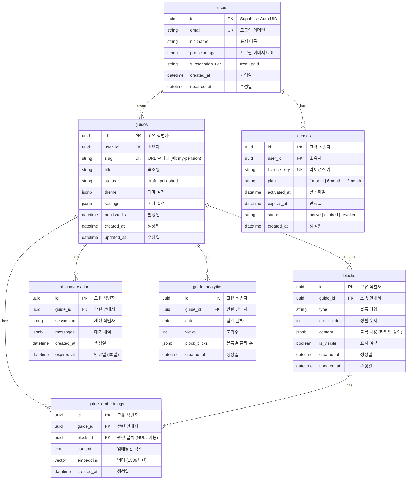
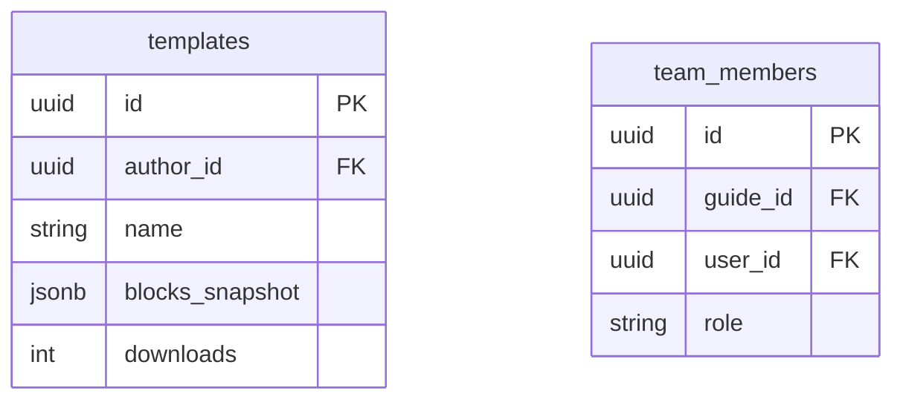

# Database Design (데이터베이스 설계) - Roomy

> Mermaid ERD로 주요 엔티티와 관계를 표현합니다.
> 각 엔티티에 FEAT 주석을 달아 어떤 기능에서 사용되는지 명시합니다.
> 최소 수집 원칙을 반영하여 불필요한 개인정보는 지양합니다.

---

## MVP 캡슐

| # | 항목 | 내용 |
|---|------|------|
| 1 | 목표 | 호스트의 시간을 벌어주고 숙소의 브랜드 가치를 높여주는 운영 솔루션 |
| 2 | 페르소나 | 감성 숙소/펜션/에어비앤비 호스트 (디자인과 고객 경험 중시, 반복 문의에 지친 상태) |
| 3 | 핵심 기능 | FEAT-1: 커스텀 에디터 (블록형 안내서 제작/수정) |
| 4 | 성공 지표 (노스스타) | 무료 → 유료 라이선스 전환율 |
| 5 | 입력 지표 | 신규 가입 호스트 수, 안내서 조회 수 |
| 6 | 비기능 요구 | 모바일에서도 PC와 동일한 수준의 에디터 경험 제공 |
| 7 | Out-of-scope | 예약 관리, 결제 시스템 자체 구현, 다크 모드 |
| 8 | Top 리스크 | 모바일 에디터 UX가 복잡해져 진입장벽이 높아질 위험 |
| 9 | 완화/실험 | 5명 이상의 실제 호스트와 프로토타입 테스트 |
| 10 | 다음 단계 | 커스텀 에디터 코어 개발 시작 |

---

## 1. ERD (Entity Relationship Diagram)



---

## 2. 엔티티 상세 정의

### 2.1 users (사용자) - FEAT-0

> Supabase Auth와 연동됩니다. `id`는 Supabase Auth의 UID와 동일합니다.

| 컬럼 | 타입 | 제약조건 | 설명 |
|------|------|----------|------|
| id | UUID | PK | Supabase Auth UID |
| email | VARCHAR(255) | UNIQUE, NOT NULL | 로그인 이메일 |
| nickname | VARCHAR(50) | NOT NULL | 표시 이름 (숙소명으로 사용 가능) |
| profile_image | VARCHAR(500) | NULL | 프로필 이미지 URL |
| subscription_tier | VARCHAR(20) | NOT NULL, DEFAULT 'free' | 구독 상태 |
| created_at | TIMESTAMPTZ | NOT NULL, DEFAULT NOW() | 가입일 |
| updated_at | TIMESTAMPTZ | NOT NULL | 최종 수정일 |

**인덱스:**
- `idx_users_email` ON email

**최소 수집 원칙 적용:**
- 필수: email, nickname
- 선택: profile_image
- 수집 안 함: 전화번호, 주소, 생년월일

---

### 2.2 guides (안내서) - FEAT-1

| 컬럼 | 타입 | 제약조건 | 설명 |
|------|------|----------|------|
| id | UUID | PK, DEFAULT gen_random_uuid() | 고유 식별자 |
| user_id | UUID | FK → users.id, NOT NULL | 소유자 |
| slug | VARCHAR(100) | UNIQUE, NOT NULL | URL 슬러그 |
| title | VARCHAR(200) | NOT NULL | 숙소명 |
| status | VARCHAR(20) | NOT NULL, DEFAULT 'draft' | draft / published |
| theme | JSONB | DEFAULT '{}' | 테마 설정 (아래 스키마 참조) |
| settings | JSONB | DEFAULT '{}' | 기타 설정 |
| published_at | TIMESTAMPTZ | NULL | 발행일 |
| created_at | TIMESTAMPTZ | NOT NULL, DEFAULT NOW() | 생성일 |
| updated_at | TIMESTAMPTZ | NOT NULL | 수정일 |

**인덱스:**
- `idx_guides_user_id` ON user_id
- `idx_guides_slug` ON slug
- `idx_guides_status` ON status

**theme JSONB 스키마:**
```typescript
interface GuideTheme {
  preset: 'emotional' | 'modern' | 'natural';
  primaryColor: string;  // HEX
  fontFamily: string;
  heroStyle: 'full' | 'card';
}
```

---

### 2.3 blocks (블록) - FEAT-2

| 컬럼 | 타입 | 제약조건 | 설명 |
|------|------|----------|------|
| id | UUID | PK, DEFAULT gen_random_uuid() | 고유 식별자 |
| guide_id | UUID | FK → guides.id, NOT NULL | 소속 안내서 |
| type | VARCHAR(50) | NOT NULL | 블록 타입 |
| order_index | INTEGER | NOT NULL | 정렬 순서 (0부터 시작) |
| content | JSONB | NOT NULL | 블록 내용 (타입별 스키마) |
| is_visible | BOOLEAN | NOT NULL, DEFAULT true | 표시 여부 |
| created_at | TIMESTAMPTZ | NOT NULL, DEFAULT NOW() | 생성일 |
| updated_at | TIMESTAMPTZ | NOT NULL | 수정일 |

**인덱스:**
- `idx_blocks_guide_id` ON guide_id
- `idx_blocks_order` ON (guide_id, order_index)

**블록 타입 (type):**

| type | 설명 | content 스키마 |
|------|------|---------------|
| `hero` | Stay Hero | `{ imageUrl, title, subtitle, welcomeMessage }` |
| `quick_info` | Quick Info | `{ checkIn, checkOut, maxGuests, parking }` |
| `amenities` | Amenities | `{ wifi: { ssid, password }, devices: [...] }` |
| `map` | Map & Parking | `{ address, lat, lng, parkingInfo, parkingImage }` |
| `host_pick` | Host's Pick | `{ places: [{ name, category, description, mapUrl, imageUrl }] }` |
| `notice` | Notice | `{ type: 'popup' | 'banner', title, content }` |
| `custom` | 사용자 정의 | `{ html, markdown }` |

**content 스키마 예시 (TypeScript):**

```typescript
// hero 블록
interface HeroContent {
  imageUrl: string;
  title: string;
  subtitle?: string;
  welcomeMessage?: string;
}

// quick_info 블록
interface QuickInfoContent {
  checkIn: string;   // "15:00"
  checkOut: string;  // "11:00"
  maxGuests: number;
  parking: {
    available: boolean;
    description?: string;
  };
}

// amenities 블록
interface AmenitiesContent {
  wifi?: {
    ssid: string;
    password: string;
  };
  devices?: Array<{
    name: string;
    description: string;
    imageUrl?: string;
  }>;
}

// map 블록
interface MapContent {
  address: string;
  lat: number;
  lng: number;
  parkingInfo?: string;
  parkingImage?: string;
}

// host_pick 블록
interface HostPickContent {
  places: Array<{
    name: string;
    category: 'restaurant' | 'cafe' | 'attraction' | 'other';
    description: string;
    mapUrl?: string;
    imageUrl?: string;
  }>;
}

// notice 블록
interface NoticeContent {
  type: 'popup' | 'banner';
  title: string;
  content: string;
  isActive: boolean;
}
```

---

### 2.4 licenses (라이선스) - BM

| 컬럼 | 타입 | 제약조건 | 설명 |
|------|------|----------|------|
| id | UUID | PK, DEFAULT gen_random_uuid() | 고유 식별자 |
| user_id | UUID | FK → users.id, NOT NULL | 소유자 |
| license_key | VARCHAR(50) | UNIQUE, NOT NULL | 라이선스 키 |
| plan | VARCHAR(20) | NOT NULL | 1month / 6month / 12month |
| activated_at | TIMESTAMPTZ | NULL | 활성화일 |
| expires_at | TIMESTAMPTZ | NOT NULL | 만료일 |
| status | VARCHAR(20) | NOT NULL, DEFAULT 'active' | active / expired / revoked |
| created_at | TIMESTAMPTZ | NOT NULL, DEFAULT NOW() | 생성일 |

**인덱스:**
- `idx_licenses_user_id` ON user_id
- `idx_licenses_key` ON license_key
- `idx_licenses_status` ON status

---

### 2.5 guide_embeddings (RAG 임베딩) - FEAT-4

| 컬럼 | 타입 | 제약조건 | 설명 |
|------|------|----------|------|
| id | UUID | PK, DEFAULT gen_random_uuid() | 고유 식별자 |
| guide_id | UUID | FK → guides.id, NOT NULL | 관련 안내서 |
| block_id | UUID | FK → blocks.id, NULL | 관련 블록 (전체 가이드면 NULL) |
| content | TEXT | NOT NULL | 임베딩된 원본 텍스트 |
| embedding | VECTOR(1536) | NOT NULL | OpenAI ada-002 임베딩 |
| created_at | TIMESTAMPTZ | NOT NULL, DEFAULT NOW() | 생성일 |

**인덱스:**
- `idx_embeddings_guide_id` ON guide_id
- `idx_embeddings_vector` ON embedding USING ivfflat (vector_cosine_ops)

---

### 2.6 ai_conversations (AI 대화 로그) - FEAT-4

| 컬럼 | 타입 | 제약조건 | 설명 |
|------|------|----------|------|
| id | UUID | PK, DEFAULT gen_random_uuid() | 고유 식별자 |
| guide_id | UUID | FK → guides.id, NOT NULL | 관련 안내서 |
| session_id | VARCHAR(100) | NOT NULL | 세션 식별자 |
| messages | JSONB | NOT NULL | 대화 내역 |
| created_at | TIMESTAMPTZ | NOT NULL, DEFAULT NOW() | 생성일 |
| expires_at | TIMESTAMPTZ | NOT NULL | 만료일 (생성 후 30일) |

**messages JSONB 스키마:**
```typescript
interface Message {
  role: 'user' | 'assistant';
  content: string;
  timestamp: string;
  sources?: string[]; // 참조된 블록 ID
}
```

---

## 3. 관계 정의

| 부모 | 자식 | 관계 | 설명 | ON DELETE |
|------|------|------|------|-----------|
| users | guides | 1:N | 사용자는 여러 안내서 소유 | CASCADE |
| users | licenses | 1:N | 사용자는 여러 라이선스 보유 가능 | CASCADE |
| guides | blocks | 1:N | 안내서는 여러 블록 포함 | CASCADE |
| guides | ai_conversations | 1:N | 안내서별 AI 대화 로그 | CASCADE |
| guides | guide_embeddings | 1:N | 안내서별 임베딩 | CASCADE |
| guides | guide_analytics | 1:N | 안내서별 통계 | CASCADE |
| blocks | guide_embeddings | 1:N | 블록별 임베딩 | SET NULL |

---

## 4. 데이터 생명주기

| 엔티티 | 생성 시점 | 보존 기간 | 삭제/익명화 |
|--------|----------|----------|------------|
| users | 회원가입 | 탈퇴 후 30일 | Hard delete |
| guides | 안내서 생성 | 계정과 동일 | CASCADE delete |
| blocks | 블록 추가 | 안내서와 동일 | CASCADE delete |
| licenses | 라이선스 구매 | 영구 (기록 보관) | 상태만 변경 |
| guide_embeddings | 블록 저장 시 | 안내서와 동일 | CASCADE delete |
| ai_conversations | AI 대화 시작 | 30일 | 자동 삭제 (TTL) |
| guide_analytics | 일별 집계 | 1년 | 익명화 후 보관 |

---

## 5. Prisma 스키마

```prisma
// prisma/schema.prisma

generator client {
  provider = "prisma-client-js"
}

datasource db {
  provider = "postgresql"
  url      = env("DATABASE_URL")
}

model User {
  id               String    @id @default(uuid()) @db.Uuid
  email            String    @unique
  nickname         String
  profileImage     String?   @map("profile_image")
  subscriptionTier String    @default("free") @map("subscription_tier")
  createdAt        DateTime  @default(now()) @map("created_at")
  updatedAt        DateTime  @updatedAt @map("updated_at")

  guides   Guide[]
  licenses License[]

  @@map("users")
}

model Guide {
  id          String    @id @default(uuid()) @db.Uuid
  userId      String    @map("user_id") @db.Uuid
  slug        String    @unique
  title       String
  status      String    @default("draft")
  theme       Json      @default("{}")
  settings    Json      @default("{}")
  publishedAt DateTime? @map("published_at")
  createdAt   DateTime  @default(now()) @map("created_at")
  updatedAt   DateTime  @updatedAt @map("updated_at")

  user            User              @relation(fields: [userId], references: [id], onDelete: Cascade)
  blocks          Block[]
  aiConversations AiConversation[]
  embeddings      GuideEmbedding[]
  analytics       GuideAnalytics[]

  @@index([userId])
  @@index([status])
  @@map("guides")
}

model Block {
  id         String   @id @default(uuid()) @db.Uuid
  guideId    String   @map("guide_id") @db.Uuid
  type       String
  orderIndex Int      @map("order_index")
  content    Json
  isVisible  Boolean  @default(true) @map("is_visible")
  createdAt  DateTime @default(now()) @map("created_at")
  updatedAt  DateTime @updatedAt @map("updated_at")

  guide      Guide            @relation(fields: [guideId], references: [id], onDelete: Cascade)
  embeddings GuideEmbedding[]

  @@index([guideId])
  @@index([guideId, orderIndex])
  @@map("blocks")
}

model License {
  id          String    @id @default(uuid()) @db.Uuid
  userId      String    @map("user_id") @db.Uuid
  licenseKey  String    @unique @map("license_key")
  plan        String
  activatedAt DateTime? @map("activated_at")
  expiresAt   DateTime  @map("expires_at")
  status      String    @default("active")
  createdAt   DateTime  @default(now()) @map("created_at")

  user User @relation(fields: [userId], references: [id], onDelete: Cascade)

  @@index([userId])
  @@index([status])
  @@map("licenses")
}

model GuideEmbedding {
  id        String   @id @default(uuid()) @db.Uuid
  guideId   String   @map("guide_id") @db.Uuid
  blockId   String?  @map("block_id") @db.Uuid
  content   String
  embedding Unsupported("vector(1536)")
  createdAt DateTime @default(now()) @map("created_at")

  guide Guide  @relation(fields: [guideId], references: [id], onDelete: Cascade)
  block Block? @relation(fields: [blockId], references: [id], onDelete: SetNull)

  @@index([guideId])
  @@map("guide_embeddings")
}

model AiConversation {
  id        String   @id @default(uuid()) @db.Uuid
  guideId   String   @map("guide_id") @db.Uuid
  sessionId String   @map("session_id")
  messages  Json
  createdAt DateTime @default(now()) @map("created_at")
  expiresAt DateTime @map("expires_at")

  guide Guide @relation(fields: [guideId], references: [id], onDelete: Cascade)

  @@index([guideId])
  @@index([sessionId])
  @@map("ai_conversations")
}

model GuideAnalytics {
  id          String   @id @default(uuid()) @db.Uuid
  guideId     String   @map("guide_id") @db.Uuid
  date        DateTime @db.Date
  views       Int      @default(0)
  blockClicks Json     @default("{}") @map("block_clicks")
  createdAt   DateTime @default(now()) @map("created_at")

  guide Guide @relation(fields: [guideId], references: [id], onDelete: Cascade)

  @@unique([guideId, date])
  @@index([guideId])
  @@map("guide_analytics")
}
```

---

## 6. Supabase RLS 정책

```sql
-- users: 본인 데이터만 접근
ALTER TABLE users ENABLE ROW LEVEL SECURITY;

CREATE POLICY "Users can view own profile"
ON users FOR SELECT
USING (auth.uid() = id);

CREATE POLICY "Users can update own profile"
ON users FOR UPDATE
USING (auth.uid() = id);

-- guides: 발행된 안내서는 누구나 조회, 수정/삭제는 소유자만
ALTER TABLE guides ENABLE ROW LEVEL SECURITY;

CREATE POLICY "Anyone can view published guides"
ON guides FOR SELECT
USING (status = 'published' OR auth.uid() = user_id);

CREATE POLICY "Hosts can manage own guides"
ON guides FOR ALL
USING (auth.uid() = user_id);

-- blocks: 안내서 권한에 따름
ALTER TABLE blocks ENABLE ROW LEVEL SECURITY;

CREATE POLICY "Blocks follow guide permissions"
ON blocks FOR ALL
USING (
  EXISTS (
    SELECT 1 FROM guides
    WHERE guides.id = blocks.guide_id
    AND (guides.status = 'published' OR guides.user_id = auth.uid())
  )
);

-- licenses: 본인만 접근
ALTER TABLE licenses ENABLE ROW LEVEL SECURITY;

CREATE POLICY "Users can view own licenses"
ON licenses FOR SELECT
USING (auth.uid() = user_id);
```

---

## 7. 확장 고려사항

### 7.1 v2에서 추가 예정 엔티티



### 7.2 인덱스 전략

- **읽기 최적화**: slug, status, user_id에 인덱스
- **벡터 검색**: pgvector의 IVFFlat 인덱스 사용
- **시계열 데이터**: guide_analytics는 날짜 기반 파티셔닝 고려

---

## Decision Log 참조

| ID | 항목 | 선택 | 근거 |
|----|------|------|------|
| DB-01 | 블록 저장 | JSONB | 유연한 스키마, 타입별 다른 구조 지원 |
| DB-02 | 벡터 저장 | pgvector | Supabase 내장, 별도 DB 불필요 |
| DB-03 | 세션 관리 | Supabase Auth | JWT 내장, RLS 연동 |
| DB-04 | AI 로그 보관 | 30일 TTL | 개인정보 최소화, 스토리지 절약 |
