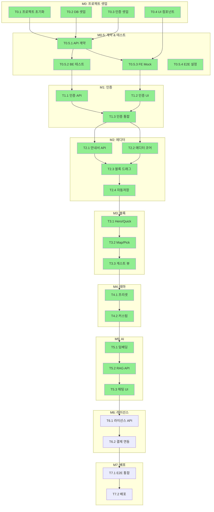
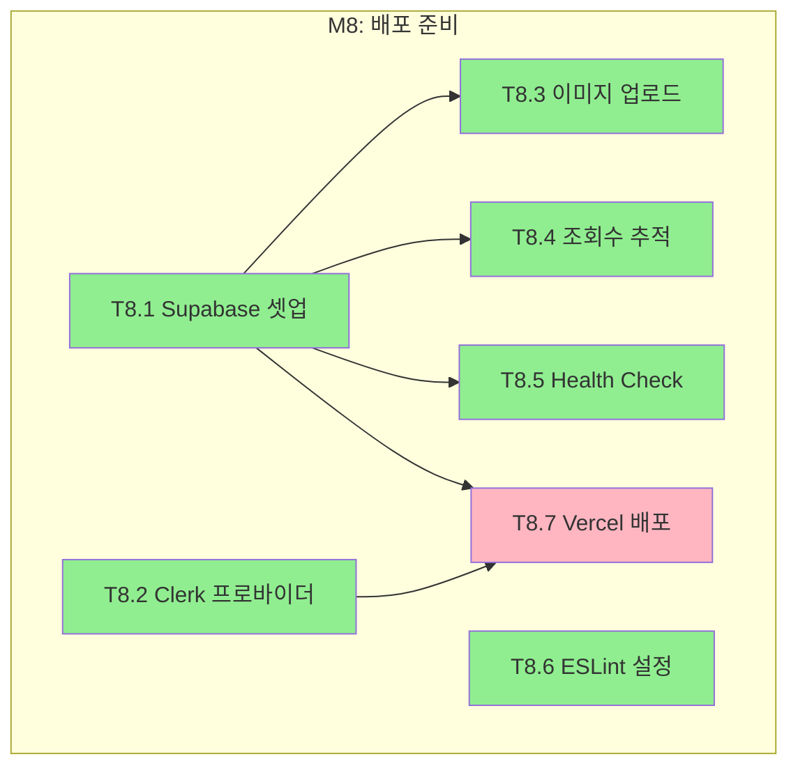

# TASKS: Roomy - 숙박업소용 모바일 웹 안내서 & AI 컨시어지

## MVP 캡슐

| # | 항목 | 내용 |
|---|------|------|
| 1 | 목표 | 호스트의 시간을 벌어주고 숙소의 브랜드 가치를 높여주는 운영 솔루션 |
| 2 | 페르소나 | 감성 숙소/펜션/에어비앤비 호스트 |
| 3 | 핵심 기능 | FEAT-1: 커스텀 에디터 (블록형 안내서 제작/수정) |
| 4 | 기술 스택 | Next.js 14+ / Hono / Supabase / Zustand / TailwindCSS |
| 5 | 노스스타 | 무료 → 유료 라이선스 전환율 |

---

## 마일스톤 개요

| 마일스톤 | Phase | 설명 | 예상 태스크 | 상태 |
|----------|-------|------|------------|------|
| M0 | Phase 0 | 프로젝트 셋업 | T0.1 ~ T0.4 | ✅ 완료 |
| M0.5 | Phase 0 | 계약 & 테스트 설계 | T0.5.1 ~ T0.5.4 | ✅ 완료 |
| M1 | Phase 1 | FEAT-0: 인증 & 온보딩 | T1.1 ~ T1.3 | ✅ 완료 |
| M2 | Phase 2 | FEAT-1: 커스텀 에디터 | T2.1 ~ T2.4 | ✅ 완료 |
| M3 | Phase 3 | FEAT-2: 필수 정보 블록 | T3.1 ~ T3.3 | ✅ 완료 |
| M4 | Phase 4 | FEAT-3: 테마 & 디자인 | T4.1 ~ T4.2 | ✅ 완료 |
| M5 | Phase 5 | FEAT-4: AI 컨시어지 | T5.1 ~ T5.3 | ✅ 완료 |
| M6 | Phase 6 | 라이선스 & 결제 | T6.1 ~ T6.2 | ✅ 완료 |
| M7 | Phase 7 | 통합 & 배포 | T7.1 ~ T7.2 | ✅ 완료 |
| M8 | Phase 8 | 배포 준비 & 품질 개선 | T8.1 ~ T8.7 | ⏳ 진행 예정 |

---

## 병렬 실행 가능 태스크

| 그룹 | 태스크 | 병렬 실행 가능 |
|------|--------|---------------|
| A | T0.1, T0.2, T0.3 | O (셋업 동시 진행) |
| B | T0.5.1, T0.5.2, T0.5.3 | O (계약 정의 동시) |
| C | T1.1 (BE), T1.2 (FE) | O (Mock API로 독립 개발) |
| D | T2.1 (BE), T2.2 (FE) | O (Mock API로 독립 개발) |
| E | T3.1, T3.2 | O (블록별 독립 개발) |
| F | T4.1, T5.1 | O (테마/AI 독립 개발) |

---

## 의존성 그래프



---

## M0: 프로젝트 셋업

### [x] Phase 0, T0.1: 프로젝트 초기화

**담당**: frontend-specialist

**작업 내용**:
- Next.js 14+ 프로젝트 생성 (App Router)
- TypeScript 설정
- TailwindCSS 설정 (Design System 컬러 적용)
- 폴더 구조 생성 (Coding Convention 참조)

**산출물**:
- `package.json`
- `tsconfig.json`
- `tailwind.config.ts`
- `src/app/layout.tsx`
- `src/app/page.tsx`

**완료 조건**:
- [x] `npm run dev`로 로컬 서버 실행 성공
- [x] TailwindCSS 스타일 적용 확인
- [x] TypeScript strict 모드 활성화

---

### [x] Phase 0, T0.2: 데이터베이스 셋업

**담당**: database-specialist

**작업 내용**:
- Supabase 프로젝트 생성
- Prisma 설정 (Supabase PostgreSQL 연결)
- 초기 스키마 생성 (Database Design 참조)
- pgvector 확장 활성화

**산출물**:
- `prisma/schema.prisma`
- `.env.example` (환경변수 템플릿)
- `DATABASE_SETUP.md` (Supabase 연결 가이드)

**완료 조건**:
- [x] `npx prisma generate` 성공
- [ ] `npx prisma db push` 성공 (Supabase 프로젝트 생성 후 실행)
- [ ] Supabase 대시보드에서 테이블 확인 (Supabase 프로젝트 생성 후 확인)

> **Note**: Supabase 프로젝트 생성은 `backend/DATABASE_SETUP.md` 가이드 참조

---

### [x] Phase 0, T0.3: Clerk 인증 셋업

**담당**: frontend-specialist

**작업 내용**:
- Clerk 미들웨어 설정
- 인증 라우트 생성 (sign-in, sign-up)
- 보호된 라우트 설정 (dashboard)
- 프로필 페이지 설정

**산출물**:
- `frontend/src/middleware.ts`
- `frontend/src/app/(auth)/sign-in/[[...sign-in]]/page.tsx`
- `frontend/src/app/(auth)/sign-up/[[...sign-up]]/page.tsx`
- `frontend/src/app/(protected)/dashboard/page.tsx`
- `frontend/src/app/(protected)/layout.tsx`
- `frontend/src/app/(auth)/layout.tsx`

**완료 조건**:
- [x] Clerk 미들웨어 설정 완료
- [x] 인증 라우트 접근 가능
- [x] 빌드 성공

> **Note**: Clerk 대시보드에서 Google/Kakao 소셜 로그인 프로바이더 설정 필요

---

### [x] Phase 0, T0.4: 기본 UI 컴포넌트 설정

**담당**: frontend-specialist

**작업 내용**:
- Design System 기반 기본 컴포넌트 생성
- Lucide 아이콘 설치
- cn() 유틸리티 함수

**산출물**:
- `frontend/src/components/ui/Button.tsx`
- `frontend/src/components/ui/Input.tsx`
- `frontend/src/components/ui/Card.tsx`
- `frontend/src/components/ui/index.ts`
- `frontend/src/lib/utils/cn.ts`

**완료 조건**:
- [x] Button 컴포넌트 3가지 variant 작동 (primary, secondary, ghost)
- [x] Input 컴포넌트 에러 상태 표시
- [x] Card 컴포넌트 스타일 적용

---

## M0.5: 계약 & 테스트 설계

### [x] Phase 0, T0.5.1: API 계약 정의

**담당**: backend-specialist

**작업 내용**:
- Zod 스키마로 API 계약 정의
- User API 계약 (Clerk 연동 프로필)
- Guide API 계약 (CRUD, publish, duplicate)
- Block API 계약 (CRUD, reorder, visibility)
- AI API 계약 (chat streaming, conversations, embed)

**산출물**:
- `frontend/src/contracts/types.ts` - 공통 타입 (블록, 테마, 라이선스 등)
- `frontend/src/contracts/user.contract.ts` - 사용자 API
- `frontend/src/contracts/guide.contract.ts` - 안내서 API
- `frontend/src/contracts/block.contract.ts` - 블록 API
- `frontend/src/contracts/ai.contract.ts` - AI 컨시어지 API
- `frontend/src/contracts/index.ts` - 내보내기

**완료 조건**:
- [x] 모든 API 엔드포인트에 대한 요청/응답 스키마 정의
- [x] Zod 타입 추론 작동 확인

---

### [x] Phase 0, T0.5.2: 백엔드 테스트 스켈레톤

**담당**: test-specialist

**작업 내용**:
- Bun 테스트 환경 설정 (Hono 앱 테스트용)
- 테스트 헬퍼 함수 작성
- 각 API에 대한 테스트 파일 생성
- 테스트 케이스 목록 작성 (RED 상태)

**산출물**:
- `backend/tests/setup.ts` - 테스트 헬퍼 (요청 함수, Mock 데이터)
- `backend/tests/api/users.test.ts` - User API 테스트 (10개 케이스)
- `backend/tests/api/guides.test.ts` - Guide API 테스트 (20개 케이스)
- `backend/tests/api/blocks.test.ts` - Block API 테스트 (18개 케이스)
- `backend/tests/api/ai.test.ts` - AI API 테스트 (16개 케이스)

**완료 조건**:
- [x] `bun test` 실행 가능 (Bun 설치 필요)
- [x] 모든 테스트가 FAILED (RED 상태 - API 미구현)

> **Note**: Bun이 설치되지 않은 환경에서는 `npx tsc --noEmit`으로 타입 검증 가능

---

### [x] Phase 0, T0.5.3: MSW Mock 핸들러 설정

**담당**: frontend-specialist

**작업 내용**:
- MSW (Mock Service Worker) 설치 및 설정
- 각 API에 대한 Mock 핸들러 생성
- Mock 데이터 정의

**산출물**:
- `frontend/src/mocks/browser.ts`
- `frontend/src/mocks/index.ts`
- `frontend/src/mocks/handlers/users.ts`
- `frontend/src/mocks/handlers/guides.ts`
- `frontend/src/mocks/handlers/blocks.ts`
- `frontend/src/mocks/handlers/ai.ts`
- `frontend/src/mocks/data/users.ts`
- `frontend/src/mocks/data/guides.ts`
- `frontend/src/components/providers/MSWProvider.tsx`
- `frontend/public/mockServiceWorker.js`

**완료 조건**:
- [x] 개발 환경에서 MSW 활성화 (NEXT_PUBLIC_API_MOCKING=enabled)
- [x] Mock API 응답 설정 완료 (User, Guide, Block, AI API)
- [x] AI 채팅 SSE 스트리밍 Mock 구현

---

### [x] Phase 0, T0.5.4: E2E 테스트 설정

**담당**: test-specialist

**작업 내용**:
- Playwright 설치 및 설정
- 주요 사용자 플로우 테스트 스켈레톤

**산출물**:
- `frontend/playwright.config.ts`
- `frontend/e2e/fixtures.ts` - 공통 테스트 유틸리티
- `frontend/e2e/auth.spec.ts` - 인증 플로우 테스트 (15개 케이스)
- `frontend/e2e/editor.spec.ts` - 에디터 플로우 테스트 (25개 케이스)
- `frontend/e2e/guest-view.spec.ts` - 게스트 뷰 테스트 (20개 케이스)

**완료 조건**:
- [x] `npm run e2e` 실행 가능
- [x] Playwright UI 모드 작동 (`npm run e2e:ui`)
- [x] 모바일/데스크탑 브라우저 테스트 설정

---

## M1: FEAT-0 인증 & 온보딩

### [x] Phase 1, T1.1: 인증 API 구현 RED→GREEN

**담당**: backend-specialist

**작업 내용**:
- Hono로 User API 라우트 생성
- Clerk 인증 미들웨어 (JWT 토큰 검증)
- Clerk 웹훅 핸들러 (사용자 동기화)
- Prisma를 통한 사용자 데이터 관리

**산출물**:
- `backend/src/routes/user.ts` - User API (GET/PATCH/DELETE /api/users/me)
- `backend/src/routes/webhook.ts` - Clerk 웹훅 핸들러
- `backend/src/lib/prisma.ts` - Prisma 클라이언트 싱글톤
- `backend/src/middleware/auth.ts` - 테스트 환경 지원 추가

**인수 조건**:
- [x] User API 엔드포인트 구현 (GET/PATCH/DELETE /api/users/me)
- [x] Clerk 웹훅 핸들러 구현 (user.created/updated/deleted)
- [x] 인증 미들웨어 테스트 환경 지원
- [x] TypeScript 컴파일 성공

---

### [x] Phase 1, T1.2: 인증 UI 구현 RED→GREEN

**담당**: frontend-specialist

**작업 내용**:
- Clerk 기반 로그인/회원가입 페이지 스타일링
- Zustand 인증 상태 관리 스토어
- 대시보드 페이지 (사용자 정보 카드)
- 프로필 설정 페이지

**산출물**:
- `frontend/src/stores/auth.ts` - Zustand 인증 스토어 (사용자 동기화, 이름 업데이트)
- `frontend/src/hooks/useUser.ts` - Clerk + 백엔드 통합 훅
- `frontend/src/components/dashboard/UserInfoCard.tsx` - 사용자 정보 카드
- `frontend/src/app/(protected)/settings/page.tsx` - 프로필/라이선스 설정 페이지
- `frontend/src/app/(auth)/layout.tsx` - 인증 레이아웃 개선

**인수 조건**:
- [x] Zustand 인증 스토어 구현
- [x] 대시보드에 사용자 정보 표시
- [x] 프로필 설정 페이지 구현 (이름 변경, 라이선스 정보)
- [x] TypeScript 빌드 성공

---

### [x] Phase 1, T1.3: 인증 통합 & 미들웨어 RED→GREEN

**담당**: backend-specialist

**의존성**: T1.1, T1.2 완료 필요

**작업 내용**:
- Next.js 미들웨어 리다이렉트 로직 강화
- API 클라이언트 인증 토큰 자동 주입
- Clerk 인증과 API 클라이언트 통합

**산출물**:
- `frontend/src/middleware.ts` - 리다이렉트 로직 (보호 라우트, 인증 페이지, 루트 페이지)
- `frontend/src/lib/api/client.ts` - 인증 헤더 자동 설정, ApiError 클래스
- `frontend/src/hooks/useApiClient.ts` - API 클라이언트 초기화 훅
- `frontend/src/hooks/index.ts` - 훅 내보내기

**인수 조건**:
- [x] 비로그인 시 `/dashboard/*`, `/editor/*`, `/settings/*`, `/admin/*` 접근 차단 → 로그인 페이지로 리다이렉트
- [x] 로그인 상태에서 인증 페이지 접근 시 대시보드로 리다이렉트
- [x] 루트 페이지에서 로그인 상태면 대시보드로 리다이렉트
- [x] API 요청에 Clerk 토큰 자동 주입
- [x] TypeScript 빌드 성공

---

## M2: FEAT-1 커스텀 에디터

### [x] Phase 2, T2.1: 안내서 CRUD API RED→GREEN

**담당**: backend-specialist

**작업 내용**:
- 안내서 목록 API (GET /api/guides) - 페이지네이션, 검색, 발행상태 필터링
- 안내서 생성 API (POST /api/guides) - 슬러그 자동 생성/커스텀 슬러그
- 안내서 조회 API (GET /api/guides/:id) - 호스트용, 인증 필요
- 슬러그 조회 API (GET /api/guides/slug/:slug) - 게스트용, 공개된 안내서만
- 안내서 수정 API (PATCH /api/guides/:id)
- 안내서 삭제 API (DELETE /api/guides/:id)
- 안내서 발행 API (POST /api/guides/:id/publish)
- 안내서 복제 API (POST /api/guides/:id/duplicate)

**산출물**:
- `backend/src/routes/guide.ts` - 안내서 CRUD + 발행 + 복제 API (Prisma 연동)
- `backend/src/lib/slug.ts` - 슬러그 생성/유효성 검사 유틸리티

**인수 조건**:
- [x] 안내서 CRUD 엔드포인트 구현
- [x] 본인 안내서만 수정/삭제 가능 (403 Forbidden)
- [x] 슬러그 중복 체크 작동 (409 Conflict)
- [x] 슬러그 자동 생성 (nanoid 기반)
- [x] 발행/발행 취소 기능
- [x] 안내서 복제 기능 (블록 포함)
- [x] TypeScript 컴파일 성공

---

### [x] Phase 2, T2.2: 에디터 코어 UI RED→GREEN

**담당**: frontend-specialist

**작업 내용**:
- 에디터 페이지 레이아웃 (PC 2-column, 모바일 full-screen 뷰 모드 토글)
- 에디터 스토어 (Zustand + subscribeWithSelector)
- 미리보기 패널 (모바일/데스크탑 프리뷰, 6종 블록 렌더링)
- 컨트롤 패널 (블록/설정/테마 아코디언)
- 블록 목록 (드래그 핸들, 가시성 토글, 복제, 삭제)
- 모바일 Bottom Sheet (블록 추가 메뉴)
- 에디터 헤더 (저장 상태, 발행, 공유)

**산출물**:
- `frontend/src/stores/editor.ts` - 에디터 상태 관리 (가이드, 블록, UI 상태, 저장)
- `frontend/src/components/editor/EditorLayout.tsx` - 메인 레이아웃
- `frontend/src/components/editor/EditorHeader.tsx` - 헤더 (뒤로가기, 제목, 발행, 메뉴)
- `frontend/src/components/editor/PreviewPanel.tsx` - 미리보기 (6종 블록 프리뷰)
- `frontend/src/components/editor/ControlPanel.tsx` - 컨트롤 패널 (블록/설정/테마)
- `frontend/src/components/editor/BlockList.tsx` - 블록 목록 (드래그앤드롭)
- `frontend/src/components/editor/MobileBottomSheet.tsx` - 모바일 블록 추가
- `frontend/src/components/editor/SaveStatus.tsx` - 저장 상태 표시
- `frontend/src/components/editor/index.ts` - 내보내기
- `frontend/src/app/(protected)/editor/[id]/page.tsx` - 에디터 페이지
- `frontend/src/app/(protected)/editor/[id]/layout.tsx` - 에디터 레이아웃

**인수 조건**:
- [x] PC: 왼쪽 컨트롤 패널 + 오른쪽 미리보기 2-column 레이아웃
- [x] 모바일: 편집/미리보기 뷰 모드 토글
- [x] 에디터 스토어 상태 관리 (블록 CRUD, UI 상태, 저장 상태)
- [x] 6종 블록 미리보기 렌더링 (hero, quick_info, amenities, map, host_pick, notice)
- [x] 블록 목록에서 드래그앤드롭 순서 변경
- [x] 모바일 Bottom Sheet 블록 추가 메뉴
- [x] TypeScript 빌드 성공

---

### [x] Phase 2, T2.3: 블록 드래그앤드롭 RED→GREEN ✅

**담당**: frontend-specialist

**완료일**: 2026-01-14

**Git Worktree 설정**:
```bash
git worktree add ../roomy-phase2-block-dnd -b phase/2-block-dnd
cd ../roomy-phase2-block-dnd
```

**TDD 사이클**:

1. **RED**: 드래그앤드롭 테스트 작성
   ```bash
   npm run test -- src/__tests__/components/editor/BlockList.test.tsx  # Expected: FAILED
   ```

2. **GREEN**: 구현
   ```bash
   npm run test -- src/__tests__/components/editor/BlockList.test.tsx  # Expected: PASSED
   ```

**작업 내용**:
- @dnd-kit/core, @dnd-kit/sortable, @dnd-kit/utilities 설치
- BlockList 컴포넌트 @dnd-kit 기반으로 업그레이드
- DndContext, SortableContext, useSortable 적용
- DragOverlay로 드래그 미리보기 구현
- PointerSensor (8px 거리 후 드래그 시작)
- TouchSensor (200ms 터치 후 드래그 시작)
- KeyboardSensor (키보드 접근성 지원)

**산출물**:
- `src/components/editor/BlockList.tsx` (업그레이드 완료)

**인수 조건**:
- [x] 블록 드래그앤드롭 작동
- [x] 순서 변경 후 Zustand 스토어 반영
- [x] 모바일에서도 터치 드래그 작동
- [x] 키보드 접근성 지원

---

### [x] Phase 2, T2.4: 자동 저장 & 발행 RED→GREEN ✅

**담당**: frontend-specialist

**완료일**: 2026-01-14

**Git Worktree 설정**:
```bash
git worktree add ../roomy-phase2-autosave -b phase/2-autosave
cd ../roomy-phase2-autosave
```

**TDD 사이클**:

1. **RED**: 자동 저장 테스트 작성
   ```bash
   npm run test -- src/__tests__/hooks/useAutoSave.test.ts  # Expected: FAILED
   ```

2. **GREEN**: 구현

**작업 내용**:
- useAutoSave 훅 구현 (2초 디바운스 자동 저장)
- useGuide 훅 구현 (가이드 CRUD API 연동)
- EditorLayout에 자동 저장 통합
- Ctrl+S / Cmd+S 키보드 단축키 저장
- 페이지 이탈 시 저장 확인 (beforeunload)
- 발행/발행 취소 기능 구현
- URL 복사 + 토스트 알림
- 안내서 삭제 확인 모달

**산출물**:
- `src/hooks/useAutoSave.ts` (신규)
- `src/hooks/useGuide.ts` (신규)
- `src/components/editor/SaveStatus.tsx` (기존)
- `src/components/editor/EditorLayout.tsx` (업데이트)
- `src/components/editor/EditorHeader.tsx` (업데이트)

**인수 조건**:
- [x] 변경 후 2초 디바운스 저장
- [x] 저장 상태 UI 표시 (저장됨/저장 중/변경됨/오류)
- [x] 발행 후 URL 자동 복사
- [x] 키보드 단축키 저장 (Ctrl+S / Cmd+S)
- [x] 페이지 이탈 시 저장 확인

---

## M3: FEAT-2 필수 정보 블록

### [x] Phase 3, T3.1: Hero & Quick Info 블록 RED→GREEN ✅

**담당**: frontend-specialist

**완료일**: 2026-01-14

**Git Worktree 설정**:
```bash
git worktree add ../roomy-phase3-blocks-hero -b phase/3-blocks-hero
cd ../roomy-phase3-blocks-hero
```

**TDD 사이클**:

1. **RED**: 블록 컴포넌트 테스트
   ```bash
   npm run test -- src/__tests__/components/blocks/Hero.test.tsx  # Expected: FAILED
   ```

2. **GREEN**: 구현

**작업 내용**:
- HeroEditor 컴포넌트 (이미지 업로드/URL, 환영 문구, 부제목, 레이아웃 스타일)
- QuickInfoEditor 컴포넌트 (체크인/아웃, 인원, 주차, 주소)
- AmenitiesEditor 컴포넌트 (Wi-Fi 정보, 편의시설 목록, 빠른 추가)
- BlockEditor 통합 컴포넌트 (블록 타입별 에디터 라우팅)
- ControlPanel에 블록 에디터 통합

**산출물**:
- `src/components/blocks/BlockEditor.tsx` (신규)
- `src/components/blocks/editors/HeroEditor.tsx` (신규)
- `src/components/blocks/editors/QuickInfoEditor.tsx` (신규)
- `src/components/blocks/editors/AmenitiesEditor.tsx` (신규)
- `src/components/blocks/editors/index.ts` (신규)
- `src/components/blocks/index.ts` (신규)
- `src/components/editor/ControlPanel.tsx` (업데이트)

**인수 조건**:
- [x] Hero 블록 편집 (이미지, 제목, 부제목, 스타일)
- [x] Quick Info 블록 편집 (체크인/아웃, 인원, 주차, 주소)
- [x] Amenities 블록 편집 (Wi-Fi 정보, 편의시설 목록)
- [x] 블록 선택 시 에디터 표시
- [x] TypeScript 빌드 성공

---

### [x] Phase 3, T3.2: Map & Host Pick 블록 RED→GREEN ✅

**담당**: frontend-specialist

**완료일**: 2026-01-14

**Git Worktree 설정**:
```bash
git worktree add ../roomy-phase3-blocks-map -b phase/3-blocks-map
cd ../roomy-phase3-blocks-map
```

**TDD 사이클**:

1. **RED**: 지도 블록 테스트
   ```bash
   npm run test -- src/__tests__/components/blocks/Map.test.tsx  # Expected: FAILED
   ```

2. **GREEN**: 구현

**작업 내용**:
- MapEditor (주소 입력, 네이버/카카오맵 URL 자동 생성, 좌표 입력)
- HostPickEditor (섹션 제목, 추천 장소 CRUD, 카테고리별 분류)
- NoticeEditor (배너/팝업 타입, 스타일 선택, 활성화 토글)
- BlockEditor 통합 완료

**산출물**:
- `src/components/blocks/editors/MapEditor.tsx` (신규)
- `src/components/blocks/editors/HostPickEditor.tsx` (신규)
- `src/components/blocks/editors/NoticeEditor.tsx` (신규)
- `src/components/blocks/editors/index.ts` (업데이트)
- `src/components/blocks/BlockEditor.tsx` (업데이트)

**인수 조건**:
- [x] 지도 링크 네이버/카카오맵 URL 자동 생성
- [x] 맛집/카페/명소 등 추천 장소 관리
- [x] 공지 배너/팝업 타입 전환 및 미리보기
- [x] TypeScript 빌드 성공

---

### [x] Phase 3, T3.3: 게스트 안내서 뷰 RED→GREEN ✅

**담당**: frontend-specialist

**완료일**: 2026-01-14

**Git Worktree 설정**:
```bash
git worktree add ../roomy-phase3-guest-view -b phase/3-guest-view
cd ../roomy-phase3-guest-view
```

**TDD 사이클**:

1. **RED**: 게스트 뷰 테스트
   ```bash
   npm run test -- src/__tests__/pages/GuestGuide.test.tsx  # Expected: FAILED
   ```

2. **GREEN**: 구현

**작업 내용**:
- 게스트용 안내서 페이지 (`/g/[slug]`)
- 블록 렌더러 (타입별 컴포넌트 매핑)
- SSR 최적화 (빠른 로딩)
- SEO 메타데이터 (제목, OG 이미지)
- 로딩 스켈레톤 및 404 페이지

**산출물**:
- `src/app/(guest)/layout.tsx`
- `src/app/(guest)/g/[slug]/page.tsx`
- `src/app/(guest)/g/[slug]/loading.tsx`
- `src/app/(guest)/g/[slug]/not-found.tsx`
- `src/components/guest/GuideRenderer.tsx`
- `src/components/guest/BlockRenderer.tsx`
- `src/components/guest/blocks/*.tsx` (6종)

**인수 조건**:
- [x] 슬러그로 안내서 조회
- [x] 모든 블록 타입 렌더링
- [x] SSR로 빠른 초기 로딩

---

## M4: FEAT-3 테마 & 디자인

### [x] Phase 4, T4.1: 프리셋 테마 시스템 RED→GREEN ✅

**담당**: frontend-specialist

**완료일**: 2026-01-14

**Git Worktree 설정**:
```bash
git worktree add ../roomy-phase4-theme -b phase/4-theme
cd ../roomy-phase4-theme
```

**작업 내용**:
- 테마 프리셋 정의 (Emotional, Modern, Natural)
- 테마 선택 UI (시각적 프리뷰 포함)
- CSS 변수 기반 테마 적용

**산출물**:
- `src/lib/theme/presets.ts`
- `src/lib/theme/fonts.ts`
- `src/lib/theme/index.ts`
- `src/components/editor/ThemeSelector.tsx`
- `src/components/guest/ThemeProvider.tsx`
- `src/app/globals.css` (CSS 변수 추가)

**인수 조건**:
- [x] 3가지 프리셋 테마 전환
- [x] 미리보기에 즉시 반영
- [x] 테마 저장 후 게스트 뷰에 적용

---

### [x] Phase 4, T4.2: 커스텀 테마 설정 RED→GREEN ✅

**담당**: frontend-specialist

**완료일**: 2026-01-14

**Git Worktree 설정**: T4.1과 통합하여 진행

**작업 내용**:
- 컬러 피커 컴포넌트
- 폰트 선택 UI (4종: Pretendard, Noto Sans KR, Noto Serif KR, 나눔고딕)
- 통합 테마 커스터마이저

**산출물**:
- `src/components/editor/ColorPicker.tsx`
- `src/components/editor/FontSelector.tsx`
- `src/components/editor/ThemeCustomizer.tsx`

**인수 조건**:
- [x] 포인트 컬러 변경 가능
- [x] 배경색 변경 가능
- [x] 폰트 변경 가능
- [x] 변경사항 실시간 미리보기

---

## M5: FEAT-4 AI 컨시어지

### [x] Phase 5, T5.1: 임베딩 & 벡터 저장 RED→GREEN ✅

**담당**: backend-specialist

**완료일**: 2026-01-14

**Git Worktree 설정**:
```bash
git worktree add ../roomy-phase5-ai -b phase/5-ai
cd ../roomy-phase5-ai
```

**작업 내용**:
- OpenAI 임베딩 API 연동 (text-embedding-3-small)
- 안내서 발행 시 블록 텍스트 임베딩
- pgvector에 벡터 저장 (1536차원)

**산출물**:
- `backend/src/services/ai/embeddings.ts`
- `backend/src/routes/ai.ts` (POST /api/guides/:guideId/ai/embed)

**인수 조건**:
- [x] 블록 텍스트 임베딩 생성
- [x] pgvector에 저장
- [x] 안내서 수정 시 임베딩 업데이트

---

### [x] Phase 5, T5.2: RAG 챗 API RED→GREEN ✅

**담당**: backend-specialist

**완료일**: 2026-01-14

**Git Worktree 설정**: T5.1과 통합하여 진행

**작업 내용**:
- RAG 검색 로직 (pgvector cosine similarity)
- GPT-4o-mini 스트리밍 응답
- SSE (Server-Sent Events) 구현

**산출물**:
- `backend/src/services/ai/rag.ts`
- `backend/src/services/ai/chat.ts`
- `backend/src/routes/ai.ts` (POST /api/guides/:guideId/ai/chat)

**인수 조건**:
- [x] 질문에 대한 관련 블록 검색
- [x] GPT 응답 스트리밍
- [x] 참조 블록 ID 반환

---

### [x] Phase 5, T5.3: AI 채팅 UI RED→GREEN ✅

**담당**: frontend-specialist

**완료일**: 2026-01-14

**Git Worktree 설정**: T5.1, T5.2와 통합하여 진행 (phase/5-ai)

**작업 내용**:
- 플로팅 AI 버튼
- 채팅 인터페이스 (모바일 전체화면, 데스크탑 패널)
- SSE 스트리밍 응답 표시
- GuideRenderer 통합

**산출물**:
- `frontend/src/components/ai/AiFloatingButton.tsx`
- `frontend/src/components/ai/ChatInterface.tsx`
- `frontend/src/components/ai/ChatMessage.tsx`
- `frontend/src/components/ai/ChatInput.tsx`
- `frontend/src/components/ai/index.ts`
- `frontend/src/hooks/useAiChat.ts`
- `frontend/src/components/guest/GuideRenderer.tsx` (업데이트)

**인수 조건**:
- [x] 플로팅 버튼으로 채팅 열기
- [x] 스트리밍 응답 표시
- [x] 모바일에서 전체화면 채팅

---

## M6: 라이선스 & 결제

### [x] Phase 6, T6.1: 라이선스 관리 API RED→GREEN ✅

**담당**: backend-specialist

**완료일**: 2026-01-14

**작업 내용**:
- 라이선스 키 검증 API (POST /api/licenses/verify)
- 라이선스 활성화 API (POST /api/licenses/activate)
- 현재 라이선스 조회 API (GET /api/licenses/me)
- 플랜별 기능 매핑 (Free/Monthly/Biannual/Annual)

**산출물**:
- `backend/src/routes/license.ts`
- `backend/src/services/license/index.ts`
- `backend/tests/license.test.ts`

**인수 조건**:
- [x] 라이선스 키 형식 검증
- [x] 키 활성화 후 유료 기능 해금
- [x] 만료된 키 거부

---

### [x] Phase 6, T6.2: 라이선스 UI & 결제 연동 RED→GREEN ✅

**담당**: frontend-specialist

**완료일**: 2026-01-14

**작업 내용**:
- 라이선스 관리 페이지 (/settings/license)
- 키 입력 폼 (LicenseForm)
- 플랜 카드 (PlanCard)
- 플랜 비교 테이블 (PlanComparison)
- 스마트스토어 결제 링크
- 워터마크 표시/제거 로직

**산출물**:
- `frontend/src/app/(protected)/settings/license/page.tsx`
- `frontend/src/components/license/LicenseForm.tsx`
- `frontend/src/components/license/PlanCard.tsx`
- `frontend/src/components/license/PlanComparison.tsx`
- `frontend/src/components/guest/Watermark.tsx`
- `frontend/src/hooks/useLicense.ts`

**인수 조건**:
- [x] 라이선스 키 입력 및 검증
- [x] 스마트스토어로 이동
- [x] 유료 전환 시 워터마크 제거

---

## M7: 통합 & 배포

### [x] Phase 7, T7.1: E2E 통합 테스트 ✅

**담당**: test-specialist

**완료일**: 2026-01-14

**작업 내용**:
- 전체 사용자 플로우 E2E 테스트
- 호스트 플로우 (가입 → 에디터 → 발행)
- 게스트 플로우 (안내서 조회 → AI 질문)
- 결제 플로우 (무료 → 유료)

**산출물**:
- `frontend/e2e/host-flow.spec.ts` (371 lines)
- `frontend/e2e/guest-flow.spec.ts` (439 lines)
- `frontend/e2e/payment-flow.spec.ts` (544 lines)

**인수 조건**:
- [x] E2E 테스트 파일 작성 완료
- [x] 주요 사용자 시나리오 커버
- [ ] 환경 변수 설정 후 테스트 실행 필요

---

### [x] Phase 7, T7.2: Vercel 배포 설정 ✅

**담당**: frontend-specialist

**완료일**: 2026-01-14

**작업 내용**:
- Backend를 Next.js API Route로 통합 (`/api/[[...route]]`)
- Hono 앱 마운트 (모든 라우트 통합)
- Vercel 배포 설정 파일 생성
- 환경 변수 템플릿 업데이트

**산출물**:
- `frontend/vercel.json`
- `frontend/src/app/api/[[...route]]/route.ts`
- `frontend/src/app/api/[[...route]]/routes/*.ts`
- `frontend/src/app/api/[[...route]]/services/**/*.ts`
- `frontend/src/lib/server/*.ts`

**인수 조건**:
- [x] API Route 통합 완료
- [x] vercel.json 생성
- [x] 빌드 성공
- [ ] Vercel 배포 (환경 변수 설정 필요)

---

## M8: 배포 준비 & 품질 개선

> **상태**: 진행 중 (T8.1, T8.2, T8.3, T8.4, T8.5, T8.6 완료)

### [x] Phase 8, T8.1: Supabase 프로젝트 생성 & DB 연결 ✅

**담당**: database-specialist

**완료일**: 2026-01-14

**작업 내용**:
- Supabase 프로젝트 생성 (https://app.supabase.com)
- PostgreSQL 연결 문자열 설정
- pgvector 확장 활성화
- Prisma 마이그레이션 실행

**산출물**:
- Supabase 프로젝트 (대시보드 접속 가능) ✅
- `.env` 환경 변수 설정 완료 ✅
- `backend/DATABASE_SETUP.md` (설정 가이드) ✅
- `backend/scripts/test-db-connection.ts` (연결 테스트) ✅

**인수 조건**:
- [x] 설정 가이드 문서 작성 (`backend/DATABASE_SETUP.md`)
- [x] 연결 테스트 스크립트 작성
- [x] Supabase 프로젝트 생성
- [x] `DATABASE_URL` 환경 변수 설정
- [x] `npx prisma db push` 성공
- [x] Supabase 대시보드에서 테이블 확인

---

### [x] Phase 8, T8.2: Clerk 소셜 로그인 프로바이더 설정 ✅

**담당**: frontend-specialist

**완료일**: 2026-01-14

**작업 내용**:
- Clerk 대시보드에서 Google OAuth 설정
- Clerk 대시보드에서 Kakao OAuth 설정
- 환경 변수 설정 (`NEXT_PUBLIC_CLERK_*`)

**산출물**:
- Clerk 프로바이더 설정 완료 ✅
- `.env.local` Clerk 환경 변수 ✅
- `frontend/CLERK_SETUP.md` (설정 가이드) ✅

**인수 조건**:
- [x] 설정 가이드 문서 작성 (`frontend/CLERK_SETUP.md`)
- [x] Google 소셜 로그인 작동
- [x] Kakao 소셜 로그인 작동
- [x] 로컬 테스트 통과

---

### [x] Phase 8, T8.3: 이미지 업로드 API 구현 ✅

**담당**: backend-specialist

**완료일**: 2026-01-14

**작업 내용**:
- Supabase Storage 설정
- 이미지 업로드 API (POST /api/upload)
- Hero 블록 이미지 업로드 연동

**산출물**:
- `frontend/src/app/api/[[...route]]/routes/upload.ts` ✅
- `backend/src/routes/upload.ts` ✅
- HeroEditor 이미지 업로드 연동 ✅

**인수 조건**:
- [x] 이미지 업로드 API 작동
- [x] Hero 에디터에서 이미지 업로드 성공
- [x] 업로드된 이미지 미리보기 표시

---

### [x] Phase 8, T8.4: 조회수 추적 구현 ✅

**담당**: backend-specialist

**완료일**: 2026-01-14

**작업 내용**:
- 안내서 조회수 추적 로직 구현
- 게스트 뷰 접근 시 조회수 증가

**산출물**:
- Guide 모델에 viewCount 필드 추가 ✅
- 슬러그 조회 시 조회수 자동 증가 로직 ✅

**인수 조건**:
- [x] 게스트 뷰 접근 시 조회수 증가
- [x] 호스트 대시보드에서 조회수 확인

---

### [x] Phase 8, T8.5: Health Check DB 연결 확인 ✅

**담당**: backend-specialist

**완료일**: 2026-01-14

**작업 내용**:
- Health 엔드포인트에 DB 연결 확인 추가

**산출물**:
- `/api/health/ready` DB 연결 확인 로직 ✅

**인수 조건**:
- [x] `/api/health`에서 DB 연결 상태 확인
- [x] DB 연결 실패 시 적절한 에러 응답

---

### [x] Phase 8, T8.6: ESLint 설정 완료 ✅

**담당**: frontend-specialist

**완료일**: 2026-01-14

**작업 내용**:
- ESLint 설정 파일 생성
- 린트 오류 수정

**산출물**:
- `frontend/.eslintrc.json`

**인수 조건**:
- [x] `npm run lint` 성공 (0 errors, 6 warnings)
- [x] 린트 오류 0개
- [x] `npm run build` 성공

---

### [ ] Phase 8, T8.7: Vercel 배포 완료

**담당**: frontend-specialist

**의존성**: T8.1, T8.2 완료 필요

**작업 내용**:
- Vercel 프로젝트 연결
- 환경 변수 설정
- 프로덕션 배포

**인수 조건**:
- [ ] Vercel 배포 URL 접속 가능
- [ ] 모든 기능 프로덕션 환경에서 작동

---

## 다음 단계

### 즉시 실행 가능
1. **T8.7**: Vercel 배포 완료

### 완료된 태스크
- ✅ **T8.1**: Supabase 프로젝트 생성 & DB 연결
- ✅ **T8.2**: Clerk 소셜 로그인 프로바이더 설정
- ✅ **T8.3**: 이미지 업로드 API 구현
- ✅ **T8.4**: 조회수 추적 구현
- ✅ **T8.5**: Health Check DB 연결 확인
- ✅ **T8.6**: ESLint 설정 완료

---

## 의존성 그래프 (M8)



> 범례: 🟢 Green = 완료, 🟡 Yellow = 사용자 작업 필요, 🩷 Pink = 의존성 대기
