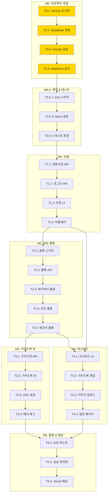

# TASKS: Roomy (루미) - AI 개발 파트너용 태스크 목록

> TDD 워크플로우, Git Worktree, Phase 규칙이 적용된 태스크 목록입니다.

---

## MVP 캡슐

| # | 항목 | 내용 |
|---|------|------|
| 1 | 목표 | 호스트의 반복 문의 응대 부담을 줄이고, 손님에게 필요한 정보를 링크 하나로 제공 |
| 2 | 페르소나 | 30대 에어비앤비/펜션 호스트 (직접 운영, 감성 숙소) |
| 3 | 핵심 기능 | FEAT-1: 필수 정보 블록 (와이파이 복사, 지도 연동 등) |
| 4 | 성공 지표 (노스스타) | 유료 구매 고객 수 |
| 5 | 입력 지표 | 주간 신규 가입 호스트 수, 가이드북 조회 수 |
| 6 | 비기능 요구 | 모바일 첫 화면 로딩 2초 이내 (SSR 최적화) |
| 7 | Out-of-scope | AI 챗봇 (v2), 결제 연동 (v2), 소셜 로그인 (v2) |
| 8 | Top 리스크 | 기존 노션/종이 안내문에 익숙한 호스트가 전환하지 않을 수 있음 |
| 9 | 완화/실험 | 무료 체험 후 유료 전환 유도, "10분 만에 만드는 가이드북" 온보딩 |
| 10 | 다음 단계 | 랜딩 페이지 제작 및 베타 테스터 모집 |

---

## 기술 스택

| 영역 | 기술 |
|------|------|
| **프론트엔드** | Next.js 14 (App Router), TypeScript, Tailwind CSS, shadcn/ui |
| **백엔드** | Next.js API Routes |
| **데이터베이스** | Supabase (PostgreSQL), Drizzle ORM |
| **인증** | Supabase Auth |
| **지도** | Kakao Maps SDK |
| **배포** | Vercel |
| **테스트** | Vitest, React Testing Library, Playwright |

---

## 마일스톤 개요

| 마일스톤 | 설명 | Phase | 태스크 수 |
|----------|------|-------|----------|
| **M0** | 프로젝트 셋업 | Phase 0 | 4 |
| **M0.5** | 계약 & 테스트 설계 | Phase 0 | 3 |
| **M1** | FEAT-0: 호스트 인증 | Phase 1 | 4 |
| **M2** | FEAT-1: 정보 블록 | Phase 2 | 5 |
| **M3** | FEAT-2: 가이드북 뷰 | Phase 3 | 4 |
| **M4** | FEAT-3: 대시보드 | Phase 4 | 4 |
| **M5** | 통합 & 배포 | Phase 5 | 3 |

---

## 의존성 그래프



---

## 병렬 실행 가능 태스크

| Phase | 병렬 가능 태스크 | 설명 |
|-------|-----------------|------|
| Phase 2 | T2.3, T2.4, T2.5 | 와이파이/지도/체크인 블록 독립 개발 가능 |
| Phase 3-4 | T3.x, T4.x | 가이드북 뷰와 대시보드 병렬 개발 가능 |

---

## M0: 프로젝트 셋업 (Phase 0)

### [x] Phase 0, T0.1: Next.js 프로젝트 초기화

**담당**: frontend-specialist

**작업 내용**:
- Next.js 14 (App Router) 프로젝트 생성
- TypeScript, Tailwind CSS 설정
- ESLint, Prettier 설정
- 폴더 구조 생성

**실행 명령어**:
```bash
pnpm create next-app@latest roomy --typescript --tailwind --eslint --app --src-dir
cd roomy
```

**산출물**:
- `package.json`
- `tsconfig.json`
- `tailwind.config.ts`
- `src/app/` 기본 구조

**완료 조건**:
- [x] `pnpm dev` 실행 시 localhost:3000 접속 가능
- [x] TypeScript 컴파일 에러 없음

---

### [x] Phase 0, T0.2: Supabase 연동

**담당**: backend-specialist

**작업 내용**:
- Supabase 프로젝트 생성
- 환경 변수 설정
- Supabase 클라이언트 설정 (client/server)
- 미들웨어 설정

**실행 명령어**:
```bash
pnpm add @supabase/supabase-js @supabase/ssr
```

**산출물**:
- `.env.local`
- `.env.example`
- `src/lib/supabase/client.ts`
- `src/lib/supabase/server.ts`
- `src/lib/supabase/middleware.ts`
- `src/middleware.ts`

**완료 조건**:
- [x] Supabase 대시보드 연결 확인
- [x] 환경 변수 설정 완료
- [x] `.env.local`이 .gitignore에 포함

---

### [x] Phase 0, T0.3: Drizzle ORM 설정

**담당**: database-specialist

**작업 내용**:
- Drizzle ORM 설치 및 설정
- DB 스키마 정의 (Database Design 문서 참조)
- 마이그레이션 설정

**실행 명령어**:
```bash
pnpm add drizzle-orm postgres
pnpm add -D drizzle-kit
```

**산출물**:
- `drizzle.config.ts`
- `src/db/schema.ts`
- `src/db/index.ts`

**완료 조건**:
- [x] `pnpm db:generate` 실행 성공
- [x] 스키마가 Supabase PostgreSQL과 연동

---

### [x] Phase 0, T0.4: shadcn/ui 및 디자인 시스템 설정

**담당**: frontend-specialist

**작업 내용**:
- shadcn/ui 설치
- Design System 문서 기반 테마 커스터마이징
- 기본 컴포넌트 설치 (Button, Input, Card, Toast)
- Lucide Icons 설치

**실행 명령어**:
```bash
pnpm dlx shadcn@latest init
pnpm dlx shadcn@latest add button input card toast
pnpm add lucide-react
```

**산출물**:
- `components.json`
- `src/components/ui/`
- `src/lib/utils.ts`
- `src/app/globals.css` (테마 변수)

**완료 조건**:
- [x] shadcn/ui 컴포넌트 렌더링 확인
- [x] Design System의 컬러 팔레트 적용

---

## M0.5: 계약 & 테스트 설계 (Phase 0)

### [x] Phase 0, T0.5.1: Zod 스키마 정의

**담당**: backend-specialist

**작업 내용**:
- API 요청/응답 검증용 Zod 스키마 정의
- Database Design 문서의 엔티티 기반

**실행 명령어**:
```bash
pnpm add zod
```

**산출물**:
- `src/lib/validations/auth.ts`
- `src/lib/validations/guidebook.ts`
- `src/lib/validations/info-block.ts`

**완료 조건**:
- [x] 모든 API 엔드포인트의 스키마 정의
- [x] 타입 추출 (z.infer) 설정

---

### [x] Phase 0, T0.5.2: MSW Mock 설정

**담당**: test-specialist

**작업 내용**:
- MSW (Mock Service Worker) 설정
- API Mock 핸들러 작성
- 테스트용 Mock 데이터 생성

**실행 명령어**:
```bash
pnpm add -D msw
```

**산출물**:
- `src/mocks/handlers/auth.ts`
- `src/mocks/handlers/guidebook.ts`
- `src/mocks/data/`
- `src/mocks/server.ts`

**완료 조건**:
- [x] Mock API 응답 확인
- [x] 테스트 환경에서 MSW 작동

---

### [x] Phase 0, T0.5.3: 테스트 환경 설정

**담당**: test-specialist

**작업 내용**:
- Vitest 설정
- React Testing Library 설정
- Playwright E2E 설정
- 테스트 헬퍼 함수 작성

**실행 명령어**:
```bash
pnpm add -D vitest @vitejs/plugin-react jsdom
pnpm add -D @testing-library/react @testing-library/user-event @testing-library/jest-dom
pnpm add -D @playwright/test
npx playwright install
```

**산출물**:
- `vitest.config.ts`
- `playwright.config.ts`
- `src/__tests__/setup.ts`
- `src/__tests__/helpers/`

**완료 조건**:
- [x] `pnpm test` 실행 가능
- [x] `pnpm test:e2e` 실행 가능

---

## M1: FEAT-0 호스트 인증 (Phase 1) - Clerk 통합 완료

> **Note**: 원래 계획된 Supabase Auth 대신 Clerk를 사용하여 구현됨
> - Google OAuth + Kakao 소셜 로그인 지원
> - 커스텀 UI (디자인 시스템 적용)
> - 호스트 DB 자동 동기화

### [x] Phase 1, T1.1: 회원가입 API RED→GREEN

**담당**: backend-specialist

**Git Worktree 설정**:
```bash
# 1. Worktree 생성
git worktree add ../roomy-phase1-auth -b phase/1-auth
cd ../roomy-phase1-auth

# 2. 작업 완료 후 병합 (사용자 승인 필요)
# git checkout main
# git merge phase/1-auth
# git worktree remove ../roomy-phase1-auth
```

**TDD 사이클**:

1. **RED**: 테스트 작성 (실패 확인)
   ```bash
   # 테스트 파일: src/__tests__/integration/api/auth-signup.test.ts
   pnpm test src/__tests__/integration/api/auth-signup.test.ts
   # Expected: FAILED
   ```

2. **GREEN**: 최소 구현 (테스트 통과)
   ```bash
   # 구현 파일: src/app/api/auth/signup/route.ts
   pnpm test src/__tests__/integration/api/auth-signup.test.ts
   # Expected: PASSED
   ```

3. **REFACTOR**: 리팩토링 (테스트 유지)
   - 에러 핸들링 개선
   - 코드 정리

**산출물**:
- `src/__tests__/integration/api/auth-signup.test.ts`
- `src/app/api/auth/signup/route.ts`

**인수 조건**:
- [ ] 테스트 먼저 작성됨 (RED 확인)
- [ ] 이메일 중복 체크 동작
- [ ] Supabase Auth 연동 완료
- [ ] 모든 테스트 통과 (GREEN)

---

### [x] Phase 1, T1.2: 로그인/로그아웃 API RED→GREEN

**담당**: backend-specialist

**Git Worktree**: phase/1-auth (T1.1과 동일 브랜치)

**TDD 사이클**:

1. **RED**: 테스트 작성 (실패 확인)
   ```bash
   # 테스트 파일: src/__tests__/integration/api/auth-login.test.ts
   pnpm test src/__tests__/integration/api/auth-login.test.ts
   ```

2. **GREEN**: 최소 구현 (테스트 통과)
   ```bash
   # 구현 파일: src/app/api/auth/login/route.ts
   # 구현 파일: src/app/api/auth/logout/route.ts
   pnpm test src/__tests__/integration/api/auth-login.test.ts
   ```

**산출물**:
- `src/__tests__/integration/api/auth-login.test.ts`
- `src/app/api/auth/login/route.ts`
- `src/app/api/auth/logout/route.ts`

**인수 조건**:
- [ ] 테스트 먼저 작성됨 (RED 확인)
- [ ] JWT 토큰 발급/검증
- [ ] 세션 관리 동작
- [ ] 모든 테스트 통과 (GREEN)

---

### [x] Phase 1, T1.3: 인증 UI 컴포넌트 RED→GREEN

**담당**: frontend-specialist

**Git Worktree**: phase/1-auth (T1.1과 동일 브랜치)

**TDD 사이클**:

1. **RED**: 테스트 작성 (실패 확인)
   ```bash
   # 테스트 파일: src/__tests__/integration/components/AuthForm.test.tsx
   pnpm test src/__tests__/integration/components/AuthForm.test.tsx
   ```

2. **GREEN**: 최소 구현 (테스트 통과)
   ```bash
   # 구현 파일: src/components/forms/AuthForm.tsx
   # 구현 파일: src/app/(auth)/login/page.tsx
   # 구현 파일: src/app/(auth)/signup/page.tsx
   pnpm test src/__tests__/integration/components/AuthForm.test.tsx
   ```

**의존성**: T1.1, T1.2 - **Mock API 사용으로 독립 개발 가능**

**산출물**:
- `src/__tests__/integration/components/AuthForm.test.tsx`
- `src/components/forms/AuthForm.tsx`
- `src/app/(auth)/login/page.tsx`
- `src/app/(auth)/signup/page.tsx`
- `src/app/(auth)/layout.tsx`

**인수 조건**:
- [ ] 테스트 먼저 작성됨 (RED 확인)
- [ ] 폼 유효성 검사 동작
- [ ] 에러 메시지 표시
- [ ] Design System 스타일 적용
- [ ] 모든 테스트 통과 (GREEN)

---

### [x] Phase 1, T1.4: 인증 미들웨어 RED→GREEN

**담당**: backend-specialist

**Git Worktree**: phase/1-auth (T1.1과 동일 브랜치)

**TDD 사이클**:

1. **RED**: 테스트 작성 (실패 확인)
   ```bash
   # 테스트 파일: src/__tests__/integration/middleware.test.ts
   pnpm test src/__tests__/integration/middleware.test.ts
   ```

2. **GREEN**: 최소 구현 (테스트 통과)
   ```bash
   # 구현 파일: src/middleware.ts (업데이트)
   pnpm test src/__tests__/integration/middleware.test.ts
   ```

**산출물**:
- `src/__tests__/integration/middleware.test.ts`
- `src/middleware.ts` (업데이트)

**인수 조건**:
- [ ] 테스트 먼저 작성됨 (RED 확인)
- [ ] 보호된 라우트 접근 제어
- [ ] 인증 상태 체크 동작
- [ ] 모든 테스트 통과 (GREEN)

**완료 시**:
- [ ] 사용자 승인 후 main 브랜치에 병합
- [ ] worktree 정리: `git worktree remove ../roomy-phase1-auth`

---

## M2: FEAT-1 정보 블록 (Phase 2)

### [x] Phase 2, T2.1: 정보 블록 DB 스키마 RED→GREEN

**담당**: database-specialist

**Git Worktree 설정**:
```bash
git worktree add ../roomy-phase2-blocks -b phase/2-blocks
cd ../roomy-phase2-blocks
```

**TDD 사이클**:

1. **RED**: 테스트 작성 (실패 확인)
   ```bash
   # 테스트 파일: src/__tests__/unit/db/schema.test.ts
   pnpm test src/__tests__/unit/db/schema.test.ts
   ```

2. **GREEN**: 최소 구현 (테스트 통과)
   ```bash
   # 구현 파일: src/db/schema.ts (info_blocks 추가)
   pnpm test src/__tests__/unit/db/schema.test.ts
   ```

**산출물**:
- `src/__tests__/unit/db/schema.test.ts`
- `src/db/schema.ts` (info_blocks, recommendations 추가)
- `src/db/migrations/` (새 마이그레이션)

**인수 조건**:
- [ ] info_blocks 테이블 생성
- [ ] recommendations 테이블 생성
- [ ] JSONB content 타입 검증
- [ ] 모든 테스트 통과 (GREEN)

---

### [x] Phase 2, T2.2: 정보 블록 CRUD API RED→GREEN

**담당**: backend-specialist

**Git Worktree**: phase/2-blocks (T2.1과 동일 브랜치)

**TDD 사이클**:

1. **RED**: 테스트 작성 (실패 확인)
   ```bash
   # 테스트 파일: src/__tests__/integration/api/info-blocks.test.ts
   pnpm test src/__tests__/integration/api/info-blocks.test.ts
   ```

2. **GREEN**: 최소 구현 (테스트 통과)
   ```bash
   # 구현 파일: src/app/api/guidebooks/[id]/blocks/route.ts
   pnpm test src/__tests__/integration/api/info-blocks.test.ts
   ```

**산출물**:
- `src/__tests__/integration/api/info-blocks.test.ts`
- `src/app/api/guidebooks/[id]/blocks/route.ts`
- `src/app/api/guidebooks/[id]/blocks/[blockId]/route.ts`

**인수 조건**:
- [ ] 테스트 먼저 작성됨 (RED 확인)
- [ ] 블록 생성/조회/수정/삭제 동작
- [ ] 정렬 순서 관리
- [ ] 모든 테스트 통과 (GREEN)

---

### [x] Phase 2, T2.3: 와이파이 블록 컴포넌트 RED→GREEN

**담당**: frontend-specialist

**Git Worktree**: phase/2-blocks (T2.1과 동일 브랜치)

**TDD 사이클**:

1. **RED**: 테스트 작성 (실패 확인)
   ```bash
   # 테스트 파일: src/__tests__/integration/components/WifiBlock.test.tsx
   pnpm test src/__tests__/integration/components/WifiBlock.test.tsx
   ```

2. **GREEN**: 최소 구현 (테스트 통과)
   ```bash
   # 구현 파일: src/components/guidebook/WifiBlock.tsx
   # 구현 파일: src/hooks/useCopyToClipboard.ts
   pnpm test src/__tests__/integration/components/WifiBlock.test.tsx
   ```

**병렬 실행 가능**: T2.4, T2.5와 병렬 개발 가능 (Mock API 사용)

**산출물**:
- `src/__tests__/integration/components/WifiBlock.test.tsx`
- `src/components/guidebook/WifiBlock.tsx`
- `src/hooks/useCopyToClipboard.ts`

**인수 조건**:
- [ ] 테스트 먼저 작성됨 (RED 확인)
- [ ] 복사 버튼 클릭 시 클립보드 복사
- [ ] 복사 성공 피드백 표시
- [ ] 모든 테스트 통과 (GREEN)

---

### [x] Phase 2, T2.4: 지도 블록 컴포넌트 RED→GREEN

**담당**: frontend-specialist

**Git Worktree**: phase/2-blocks (T2.1과 동일 브랜치)

**TDD 사이클**:

1. **RED**: 테스트 작성 (실패 확인)
   ```bash
   # 테스트 파일: src/__tests__/integration/components/MapBlock.test.tsx
   pnpm test src/__tests__/integration/components/MapBlock.test.tsx
   ```

2. **GREEN**: 최소 구현 (테스트 통과)
   ```bash
   # 구현 파일: src/components/guidebook/MapBlock.tsx
   pnpm test src/__tests__/integration/components/MapBlock.test.tsx
   ```

**병렬 실행 가능**: T2.3, T2.5와 병렬 개발 가능

**추가 설치**:
```bash
# Kakao Maps SDK는 script 태그로 로드
```

**산출물**:
- `src/__tests__/integration/components/MapBlock.test.tsx`
- `src/components/guidebook/MapBlock.tsx`
- `src/hooks/useKakaoMap.ts`

**인수 조건**:
- [ ] 테스트 먼저 작성됨 (RED 확인)
- [ ] Kakao Maps 표시
- [ ] 지도 앱 연결 (카카오맵/네이버맵/애플지도)
- [ ] 모든 테스트 통과 (GREEN)

---

### [x] Phase 2, T2.5: 체크인/추천 블록 컴포넌트 RED→GREEN

**담당**: frontend-specialist

**Git Worktree**: phase/2-blocks (T2.1과 동일 브랜치)

**TDD 사이클**:

1. **RED**: 테스트 작성 (실패 확인)
   ```bash
   # 테스트 파일: src/__tests__/integration/components/CheckinBlock.test.tsx
   # 테스트 파일: src/__tests__/integration/components/RecommendationBlock.test.tsx
   pnpm test src/__tests__/integration/components/CheckinBlock.test.tsx
   ```

2. **GREEN**: 최소 구현 (테스트 통과)
   ```bash
   # 구현 파일: src/components/guidebook/CheckinBlock.tsx
   # 구현 파일: src/components/guidebook/RecommendationBlock.tsx
   pnpm test src/__tests__/integration/components/
   ```

**병렬 실행 가능**: T2.3, T2.4와 병렬 개발 가능

**산출물**:
- `src/__tests__/integration/components/CheckinBlock.test.tsx`
- `src/__tests__/integration/components/RecommendationBlock.test.tsx`
- `src/components/guidebook/CheckinBlock.tsx`
- `src/components/guidebook/RecommendationBlock.tsx`

**인수 조건**:
- [ ] 테스트 먼저 작성됨 (RED 확인)
- [ ] 체크인/아웃 시간 표시
- [ ] 추천 장소 카드 표시
- [ ] 모든 테스트 통과 (GREEN)

**완료 시**:
- [ ] 사용자 승인 후 main 브랜치에 병합
- [ ] worktree 정리: `git worktree remove ../roomy-phase2-blocks`

---

## M3: FEAT-2 가이드북 뷰 (Phase 3)

### [x] Phase 3, T3.1: 가이드북 CRUD API RED→GREEN

**담당**: backend-specialist

**Git Worktree 설정**:
```bash
git worktree add ../roomy-phase3-guidebook -b phase/3-guidebook
cd ../roomy-phase3-guidebook
```

**TDD 사이클**:

1. **RED**: 테스트 작성 (실패 확인)
   ```bash
   # 테스트 파일: src/__tests__/integration/api/guidebooks.test.ts
   pnpm test src/__tests__/integration/api/guidebooks.test.ts
   ```

2. **GREEN**: 최소 구현 (테스트 통과)
   ```bash
   # 구현 파일: src/app/api/guidebooks/route.ts
   # 구현 파일: src/app/api/guidebooks/[id]/route.ts
   pnpm test src/__tests__/integration/api/guidebooks.test.ts
   ```

**산출물**:
- `src/__tests__/integration/api/guidebooks.test.ts`
- `src/app/api/guidebooks/route.ts`
- `src/app/api/guidebooks/[id]/route.ts`
- `src/app/api/public/guidebooks/[slug]/route.ts`

**인수 조건**:
- [ ] 테스트 먼저 작성됨 (RED 확인)
- [ ] 가이드북 CRUD 동작
- [ ] 공개 가이드북 slug 조회
- [ ] RLS 정책 적용
- [ ] 모든 테스트 통과 (GREEN)

---

### [x] Phase 3, T3.2: 가이드북 뷰 컴포넌트 RED→GREEN

**담당**: frontend-specialist

**Git Worktree**: phase/3-guidebook (T3.1과 동일 브랜치)

**TDD 사이클**:

1. **RED**: 테스트 작성 (실패 확인)
   ```bash
   # 테스트 파일: src/__tests__/integration/components/GuidebookView.test.tsx
   pnpm test src/__tests__/integration/components/GuidebookView.test.tsx
   ```

2. **GREEN**: 최소 구현 (테스트 통과)
   ```bash
   # 구현 파일: src/components/guidebook/GuidebookView.tsx
   # 구현 파일: src/components/guidebook/GuidebookHeader.tsx
   # 구현 파일: src/components/guidebook/InfoBlock.tsx
   pnpm test src/__tests__/integration/components/GuidebookView.test.tsx
   ```

**산출물**:
- `src/__tests__/integration/components/GuidebookView.test.tsx`
- `src/components/guidebook/GuidebookView.tsx`
- `src/components/guidebook/GuidebookHeader.tsx`
- `src/components/guidebook/InfoBlock.tsx`

**인수 조건**:
- [ ] 테스트 먼저 작성됨 (RED 확인)
- [ ] 헤더 (숙소명, 사진) 표시
- [ ] 정보 블록 목록 렌더링
- [ ] Design System 스타일 적용
- [ ] 모든 테스트 통과 (GREEN)

---

### [x] Phase 3, T3.3: SSG/ISR 설정 RED→GREEN

**담당**: frontend-specialist

**Git Worktree**: phase/3-ssg

**TDD 사이클**:

1. **RED**: 테스트 작성 (실패 확인)
   ```bash
   # 테스트 파일: src/__tests__/integration/pages/guidebook-page.test.tsx
   pnpm test src/__tests__/integration/pages/guidebook-page.test.tsx
   ```

2. **GREEN**: 최소 구현 (테스트 통과)
   ```bash
   # 구현 파일: src/app/g/[slug]/page.tsx
   pnpm test src/__tests__/integration/pages/guidebook-page.test.tsx
   ```

**산출물**:
- `src/__tests__/integration/pages/guidebook-page.test.tsx`
- `src/app/g/[slug]/page.tsx` (revalidate=60)
- `src/app/g/[slug]/loading.tsx`
- `src/app/g/[slug]/not-found.tsx`
- `src/lib/data/guidebook.ts` (React cache 적용)

**인수 조건**:
- [x] 테스트 먼저 작성됨 (RED 확인)
- [x] SSG로 정적 페이지 생성 (generateStaticParams)
- [x] ISR로 재검증 (revalidate=60초)
- [x] 404 페이지 처리
- [x] 모든 테스트 통과 (GREEN) - 9개 테스트

---

### [x] Phase 3, T3.4: 메타 태그 및 OG 이미지 RED→GREEN

**담당**: frontend-specialist

**Git Worktree**: phase/3-meta

**TDD 사이클**:

1. **RED**: 테스트 작성 (실패 확인)
   ```bash
   # 테스트 파일: src/__tests__/unit/utils/metadata.test.ts
   pnpm test src/__tests__/unit/utils/metadata.test.ts
   ```

2. **GREEN**: 최소 구현 (테스트 통과)
   ```bash
   # 구현 파일: src/lib/utils/metadata.ts
   # 구현 파일: src/app/api/og/route.tsx
   pnpm test src/__tests__/unit/utils/metadata.test.ts
   ```

**산출물**:
- `src/__tests__/unit/utils/metadata.test.ts`
- `src/lib/utils/metadata.ts` (메타데이터 유틸리티)
- `src/app/api/og/route.tsx` (동적 OG 이미지 Edge API)
- `src/app/g/[slug]/page.tsx` (리팩토링)

**인수 조건**:
- [x] 테스트 먼저 작성됨 (RED 확인)
- [x] 동적 메타 태그 생성 (OpenGraph, Twitter, robots)
- [x] OG 이미지 설정 (동적 이미지 생성 API)
- [x] 모든 테스트 통과 (GREEN) - 12개 테스트

**완료 시**:
- [ ] 사용자 승인 후 main 브랜치에 병합
- [ ] worktree 정리: `git worktree remove ../roomy-phase3-guidebook`

---

## M4: FEAT-3 대시보드 (Phase 4)

### [ ] Phase 4, T4.1: 대시보드 레이아웃 RED→GREEN

**담당**: frontend-specialist

**Git Worktree 설정**:
```bash
git worktree add ../roomy-phase4-dashboard -b phase/4-dashboard
cd ../roomy-phase4-dashboard
```

**TDD 사이클**:

1. **RED**: 테스트 작성 (실패 확인)
   ```bash
   # 테스트 파일: src/__tests__/integration/pages/dashboard.test.tsx
   pnpm test src/__tests__/integration/pages/dashboard.test.tsx
   ```

2. **GREEN**: 최소 구현 (테스트 통과)
   ```bash
   # 구현 파일: src/app/(dashboard)/dashboard/page.tsx
   # 구현 파일: src/app/(dashboard)/layout.tsx
   pnpm test src/__tests__/integration/pages/dashboard.test.tsx
   ```

**산출물**:
- `src/__tests__/integration/pages/dashboard.test.tsx`
- `src/app/(dashboard)/dashboard/page.tsx`
- `src/app/(dashboard)/layout.tsx`
- `src/components/layout/Sidebar.tsx`
- `src/components/layout/DashboardHeader.tsx`

**인수 조건**:
- [ ] 테스트 먼저 작성됨 (RED 확인)
- [ ] 가이드북 목록 표시
- [ ] 새 가이드북 생성 버튼
- [ ] 반응형 레이아웃
- [ ] 모든 테스트 통과 (GREEN)

---

### [ ] Phase 4, T4.2: 가이드북 편집 페이지 RED→GREEN

**담당**: frontend-specialist

**Git Worktree**: phase/4-dashboard (T4.1과 동일 브랜치)

**TDD 사이클**:

1. **RED**: 테스트 작성 (실패 확인)
   ```bash
   # 테스트 파일: src/__tests__/integration/pages/guidebook-edit.test.tsx
   pnpm test src/__tests__/integration/pages/guidebook-edit.test.tsx
   ```

2. **GREEN**: 최소 구현 (테스트 통과)
   ```bash
   # 구현 파일: src/app/(dashboard)/dashboard/[id]/edit/page.tsx
   # 구현 파일: src/components/forms/GuidebookForm.tsx
   # 구현 파일: src/components/forms/InfoBlockForm.tsx
   pnpm test src/__tests__/integration/pages/guidebook-edit.test.tsx
   ```

**산출물**:
- `src/__tests__/integration/pages/guidebook-edit.test.tsx`
- `src/app/(dashboard)/dashboard/new/page.tsx`
- `src/app/(dashboard)/dashboard/[id]/edit/page.tsx`
- `src/components/forms/GuidebookForm.tsx`
- `src/components/forms/InfoBlockForm.tsx`

**인수 조건**:
- [ ] 테스트 먼저 작성됨 (RED 확인)
- [ ] 가이드북 기본 정보 편집
- [ ] 정보 블록 추가/수정/삭제
- [ ] 드래그 앤 드롭 정렬
- [ ] 실시간 미리보기
- [ ] 모든 테스트 통과 (GREEN)

---

### [ ] Phase 4, T4.3: 이미지 업로드 RED→GREEN

**담당**: backend-specialist

**Git Worktree**: phase/4-dashboard (T4.1과 동일 브랜치)

**TDD 사이클**:

1. **RED**: 테스트 작성 (실패 확인)
   ```bash
   # 테스트 파일: src/__tests__/integration/api/upload.test.ts
   pnpm test src/__tests__/integration/api/upload.test.ts
   ```

2. **GREEN**: 최소 구현 (테스트 통과)
   ```bash
   # 구현 파일: src/app/api/upload/route.ts
   # 구현 파일: src/components/forms/ImageUpload.tsx
   pnpm test src/__tests__/integration/api/upload.test.ts
   ```

**산출물**:
- `src/__tests__/integration/api/upload.test.ts`
- `src/app/api/upload/route.ts`
- `src/components/forms/ImageUpload.tsx`

**인수 조건**:
- [ ] 테스트 먼저 작성됨 (RED 확인)
- [ ] Supabase Storage 업로드
- [ ] 이미지 리사이즈/최적화
- [ ] 업로드 진행률 표시
- [ ] 모든 테스트 통과 (GREEN)

---

### [ ] Phase 4, T4.4: 설정 페이지 RED→GREEN

**담당**: frontend-specialist

**Git Worktree**: phase/4-dashboard (T4.1과 동일 브랜치)

**TDD 사이클**:

1. **RED**: 테스트 작성 (실패 확인)
   ```bash
   # 테스트 파일: src/__tests__/integration/pages/settings.test.tsx
   pnpm test src/__tests__/integration/pages/settings.test.tsx
   ```

2. **GREEN**: 최소 구현 (테스트 통과)
   ```bash
   # 구현 파일: src/app/(dashboard)/dashboard/settings/page.tsx
   pnpm test src/__tests__/integration/pages/settings.test.tsx
   ```

**산출물**:
- `src/__tests__/integration/pages/settings.test.tsx`
- `src/app/(dashboard)/dashboard/settings/page.tsx`

**인수 조건**:
- [ ] 테스트 먼저 작성됨 (RED 확인)
- [ ] 프로필 정보 수정
- [ ] 비밀번호 변경
- [ ] 계정 삭제
- [ ] 모든 테스트 통과 (GREEN)

**완료 시**:
- [ ] 사용자 승인 후 main 브랜치에 병합
- [ ] worktree 정리: `git worktree remove ../roomy-phase4-dashboard`

---

## M5: 통합 & 배포 (Phase 5)

### [ ] Phase 5, T5.1: E2E 테스트 작성

**담당**: test-specialist

**Git Worktree 설정**:
```bash
git worktree add ../roomy-phase5-deploy -b phase/5-deploy
cd ../roomy-phase5-deploy
```

**TDD 사이클**:

1. **RED**: 테스트 작성 (실패 확인)
   ```bash
   # 테스트 파일: e2e/guidebook-flow.spec.ts
   pnpm test:e2e e2e/guidebook-flow.spec.ts
   ```

2. **GREEN**: 버그 수정 (테스트 통과)
   ```bash
   pnpm test:e2e
   ```

**산출물**:
- `e2e/auth-flow.spec.ts`
- `e2e/guidebook-creation.spec.ts`
- `e2e/guidebook-view.spec.ts`

**인수 조건**:
- [ ] 호스트 회원가입 → 로그인 플로우
- [ ] 가이드북 생성 → 편집 → 발행 플로우
- [ ] 손님 가이드북 조회 플로우
- [ ] 모든 E2E 테스트 통과

---

### [ ] Phase 5, T5.2: 성능 최적화

**담당**: frontend-specialist

**Git Worktree**: phase/5-deploy (T5.1과 동일 브랜치)

**작업 내용**:
- Lighthouse 점수 측정 및 개선
- 이미지 최적화 (next/image)
- 번들 사이즈 분석 및 최적화
- Core Web Vitals 개선

**산출물**:
- `next.config.js` (최적화 설정)
- Lighthouse 리포트

**인수 조건**:
- [ ] LCP < 2초
- [ ] FID < 100ms
- [ ] CLS < 0.1
- [ ] Lighthouse 성능 점수 90+ (모바일)

---

### [ ] Phase 5, T5.3: Vercel 배포

**담당**: frontend-specialist

**Git Worktree**: phase/5-deploy (T5.1과 동일 브랜치)

**작업 내용**:
- Vercel 프로젝트 연결
- 환경 변수 설정
- 도메인 연결
- Preview 배포 확인

**산출물**:
- Vercel 프로젝트 설정
- 프로덕션 URL

**인수 조건**:
- [ ] Preview 배포 동작
- [ ] 프로덕션 배포 성공
- [ ] 환경 변수 적용 확인
- [ ] HTTPS 동작

**완료 시**:
- [ ] 사용자 승인 후 main 브랜치에 병합
- [ ] worktree 정리: `git worktree remove ../roomy-phase5-deploy`

---

## 다음 우선순위 작업

1. **T0.1**: Next.js 프로젝트 초기화 시작
2. **T0.2**: Supabase 연동 (T0.1 완료 후)
3. **T0.3**: Drizzle 설정 (T0.2 완료 후)
4. **T0.4**: shadcn/ui 설정 (T0.3 완료 후)

---

## 체크리스트

- [x] 모든 태스크 ID에 Phase 접두사 포함
- [x] 모든 Phase 1+ 태스크에 Git Worktree 설정 포함
- [x] 모든 Phase 1+ 태스크에 TDD 사이클 포함
- [x] 의존성 있는 태스크에 Mock 설정 언급
- [x] 병렬 실행 가능 태스크 테이블 포함
- [x] 의존성 그래프 (Mermaid) 포함
